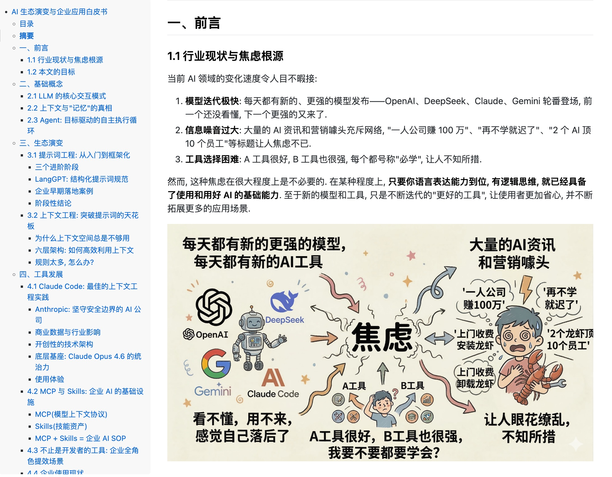
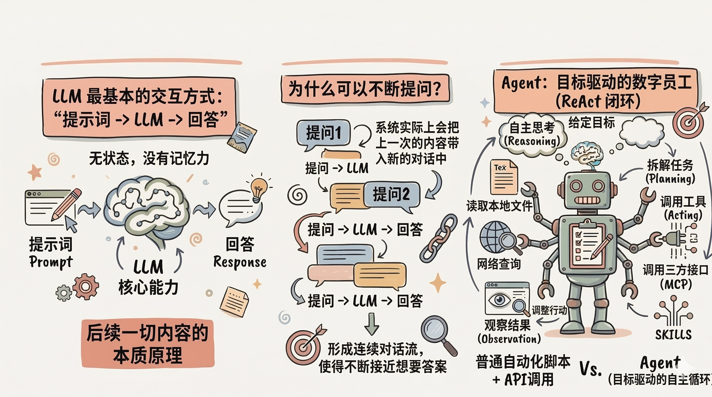
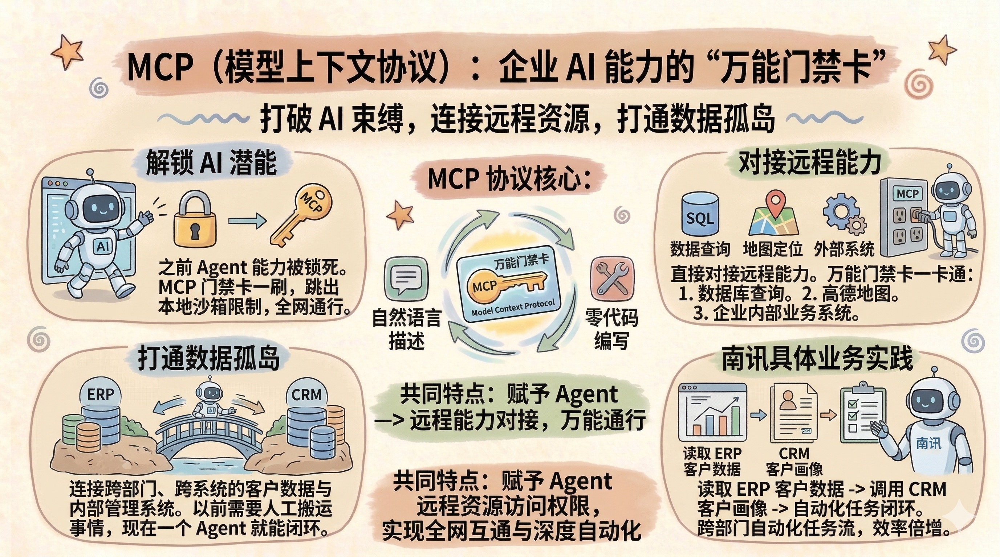
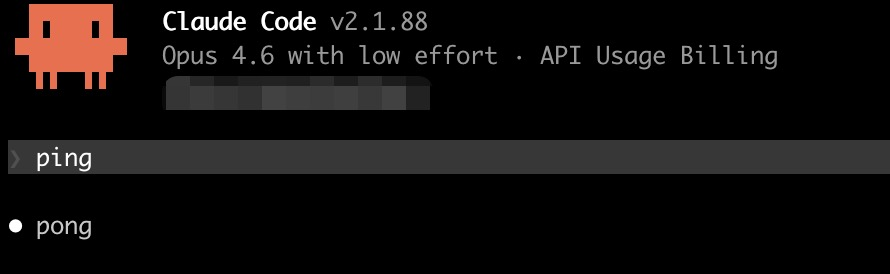

# AI Wiki

AI 企业培训白皮书及相关资料合集。

## 内容

- [白皮书/](./白皮书/) — AI 生态演变与企业应用白皮书（含配图）
- [安装指南/](./安装指南/) — Claude Code 安装指南（Mac 版，含 M 芯片与 Intel 芯片）

### 白皮书示例

### 部分内容预览

### 安装指南预览

Claude Code Mac 安装指南，覆盖以下内容：

- 网络环境检查与科学上网配置
- iTerm2 终端安装
- CC-Switch 配置管理工具安装
- M 芯片 Mac 一键安装
- Intel 芯片 Mac 通过 nvm + npm 安装

> 本项目持续更新中，欢迎关注。

## License

本项目采用 [MIT License](./LICENSE) 开源。
