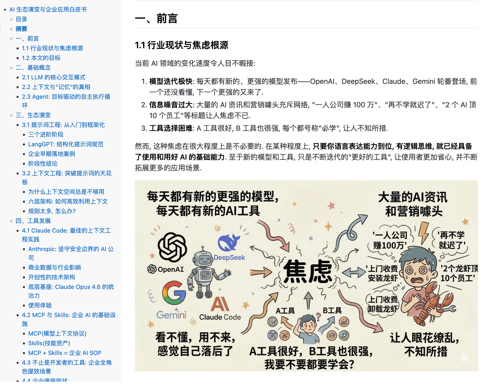
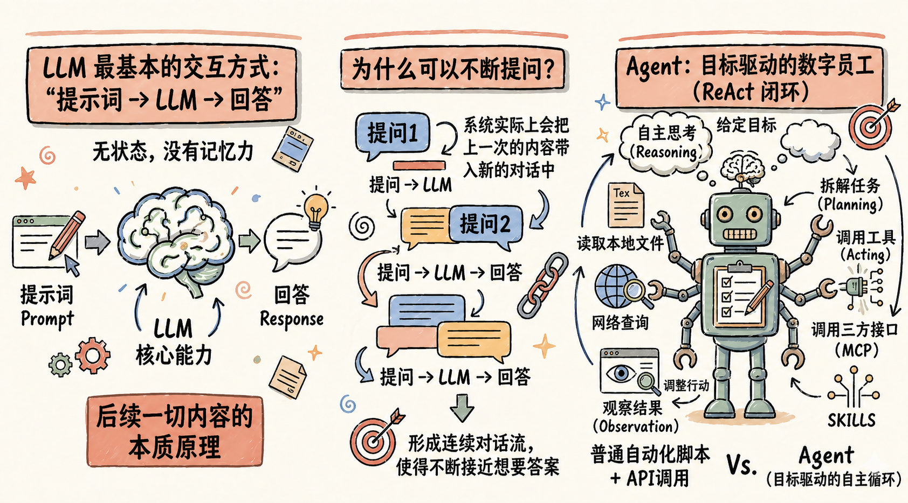
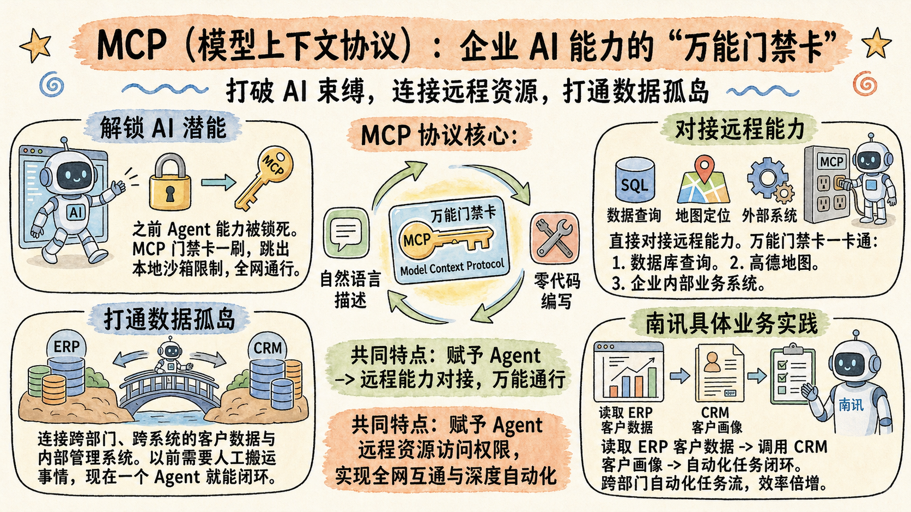
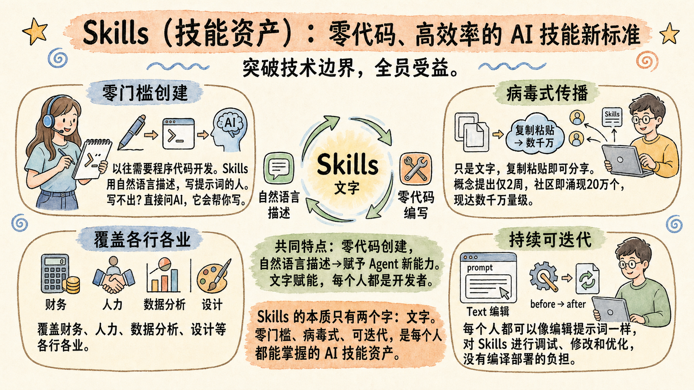

# AI Wiki

AI 企业培训白皮书与 Claude Code 实操指南合集. 围绕"为什么用, 怎么装, 怎么落地"三件事, 沉淀可直接复用的内容.

## 内容总览

| 文件 | 简介 |
|------|------|
| 📘 [AI 生态演变与企业应用](./白皮书/AI生态演变与企业应用/AI生态演变与企业应用-白皮书.md) | 提示词工程 / 上下文工程 / 工具发展(Claude Code · MCP · Skills · OpenClaw)全梳理 |
| 📘 [AI 时代, 销售如何不仅仅是销售](./白皮书/AI时代,销售如何不仅仅是销售/AI时代,销售如何不仅仅是销售-白皮书.md) | Obsidian + Claude Code + 影刀 RPA 的全链路销售赋能 |
| 📗 [Obsidian 使用白皮书(配套)](./白皮书/AI时代,销售如何不仅仅是销售/Obsidian使用白皮书.md) | AI 时代个人知识库底座(claudian + Get 笔记) |
| 🛠️ [SKILLS — Claude Code 技能合集](./SKILLS/README.md) | 官方 skill-creator + 3 个自研 skill(提示词审查 / 寓言教学 / 项目工程化工作流)+ 第三方接入实操 |
| 💻 [安装指南 - Mac](./安装指南/ClaudeCode安装指南-Mac.md) | macOS 完整安装闭环(科学上网 · iTerm2 · CC-Switch · M/Intel 芯片) |
| 💻 [安装指南 - Windows(简版)](./安装指南/ClaudeCode安装指南-Windows-简版.md) | Windows 简版安装流程 |

## 内容预览

## 持续更新

本项目持续更新中, 欢迎 Star / Watch.

## Star History

## License

本项目采用 [MIT License](./LICENSE) 开源.
