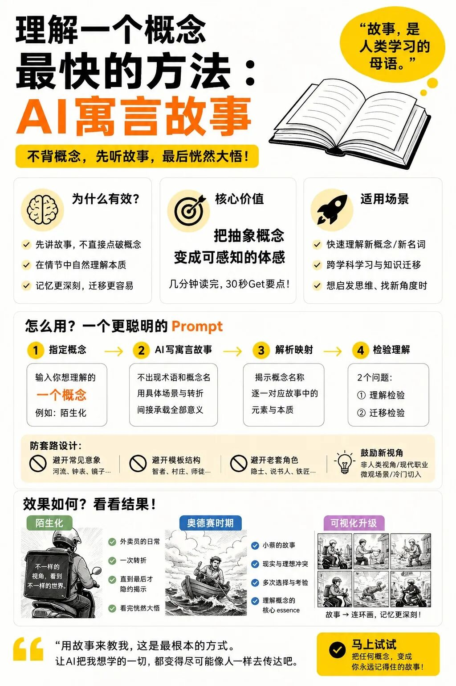
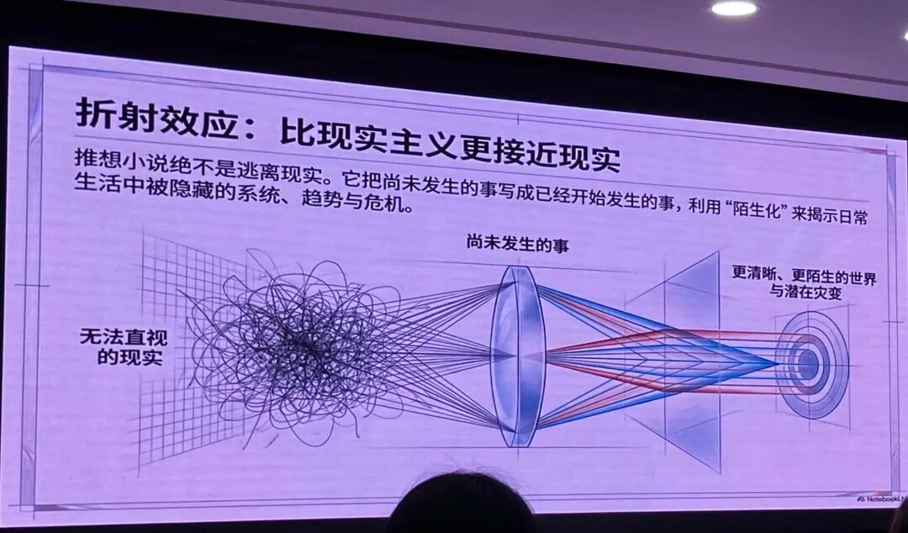

# learn-by-story · 寓言学概念

> **新时代的阅读理解**
> 传统的阅读理解是:读一段文字,回答关于这段文字的问题。
> 这套方法把它**反过来**——你读一个故事,故事里却藏着一个你"还不知道自己正在学"的概念;读到最后那一刻"原来讲的是这个",概念连同故事一起钉进了记忆。
> 不背概念,先听故事,最后恍然大悟。

一个 Claude Code skill:你给它**一个陌生或抽象的概念**,它用一则**不点破概念名**的寓言把这个概念"演"给你看,再附上概念解析与两道检验题,帮你几分钟内真正吃透它。

---

## 怎么用

在 Claude Code 里直接说:**"用寓言讲讲 XX"** / **"帮我吃透 XX 这个概念"**(XX 可以是任何理论、术语、原理、机制,如"注意力机制""第一性原理""复利""熵增")。skill 会输出三部分:

1. **寓言正文** —— 不出现概念名、不用术语,用一个具体场景+转折间接承载全部意义。
2. **概念解析** —— 揭示概念叫什么、属于哪个学科、内核是什么,并逐一对应故事元素 → 概念部件。
3. **两道检验题** —— ① 理解检验(是否抓住内核)② 迁移检验(能否迁到别的领域)。

> 📌 skill 的完整行为规范见同目录 **`SKILL.md`**(它才是唯一的执行依据)。本 README 与 `images/` 是**补充说明**,只用于讲清这套方法的来历与道理,**不改变 skill 的任何行为**。

---

## 方法溯源

| | |
|---|---|
| **最初提出** | Anthropic 的 **Amanda Askell**(Claude 性格对齐团队负责人、Claude 宪法主创),在 2025 年 4 月一次访谈中分享。她常在无聊时让 Claude 讲寓言,久而久之"脑子里装了好多小故事,每个对应一个学科概念——有时学名忘了,故事还记着"。 |
| **优化并撰文** | **卡兹克(数字生命卡兹克)**,在原版上做了三点关键优化:① 增加防套路约束(避开高频意象/结构/角色);② 把"指定领域、让 AI 随机挑概念"改为"**指定一个具体概念**";③ 结尾加两道检验题。 |
| **原文链接** | 《分享一个很实用的寓言故事 prompt,5 分钟帮你理解任何新概念。》<br><https://mp.weixin.qq.com/s/L1ISA0FvxY_7OR994RttWw> |

本 skill 在卡兹克版的基础上,又沉淀了大量实测得来的"写作心法"(抓内核、展示而非说明、单主角/对照都可、防套路回查纪律等),详见 `SKILL.md`。

### 方法概览(原文配图)



---

## 补充:为什么"故事"能讲透概念 —— 折射效应与"陌生化"

下面这张图(来自一场关于推想小说的分享)是理解这套方法**为什么有效**的极好补充:



图里讲的是**折射效应**:有些现实**无法直视**(左侧那团乱麻),但当你把它写成一个具体的、略显陌生的故事(中间那面透镜),它反而被**折射、聚焦**成"更清晰、更陌生的世界"(右侧)。推想小说之所以"比现实主义更接近现实",正是靠**"陌生化"**——把习以为常、因而看不见的系统、趋势与本质,重新变得**可被看见**。

**这正是寓言讲概念的同一套机制**:
- 一个抽象概念,你直接啃定义往往**抓不住**(无法直视的现实);
- 把它写成一个具体寓言(透镜),概念的内核就被**折射成一个你能感知的画面**;
- 读者在"陌生"的故事里,反而第一次**真正看清**了那个本来抽象的道理。

所以这套方法的核心价值,用图上那句话说,就是——**把抽象概念变成可感知的"体感"**。

---

## 目录结构

```
learn-by-story/
├── SKILL.md                          # 唯一执行依据(skill 行为规范)
├── README.md                         # 本文件:方法来历与道理的补充说明
├── images/
│   ├── method-infographic.png        # 原文方法概览图
│   └── refraction-defamiliarization.png  # 折射效应 / 陌生化 补充图
└── references/
    ├── examples.md                   # 三则金标准范例(两对照 + 一单主角)
    └── original-prompt.md            # 卡兹克优化后的原始 prompt 存档 + 溯源
```

---

> "用故事来教我,这是最根本的方式。让 AI 把我想学的一切,都变得尽可能像人一样去传达吧。"
> 把任何概念,变成你永远记得住的故事。
