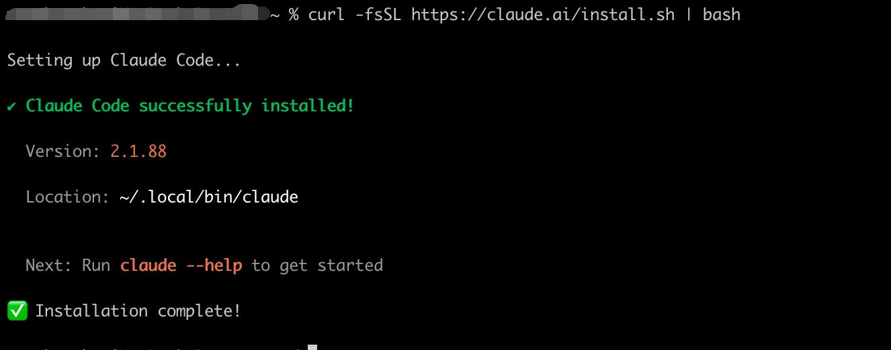

# Claude Code 安装指南 — Mac

> **作者**: @Mzs | **日期**: 2026/3/31 | **版本**: v1.0.1
>
> GitHub: [github.com/Mzs-code/ai-wiki](https://github.com/Mzs-code/ai-wiki)

---

## 目录

- [名词说明](#名词说明)
- [一、检查网络情况](#一检查网络情况)
- [二、安装 iTerm2](#二安装-iterm2)
- [三、安装 CC-Switch](#三安装-cc-switch)
- [四、检查芯片类型](#四检查芯片类型)
- [五、M 芯片 Mac 安装步骤](#五m-芯片-mac-安装步骤)
- [六、Intel 芯片 Mac 安装步骤](#六intel-芯片-mac-安装步骤)
- [附录：科学上网配置](#附录科学上网配置)

---

## 名词说明

在开始之前, 先了解两个会反复出现的概念:

| 术语 | 说明 |
|------|------|
| **终端(Terminal)** | Mac 自带的命令行工具, 可以用来输入命令和执行程序 |
| **科学上网** | 即使用 VPN 等工具访问 Google、GitHub 等海外服务, 安装 Claude Code 时需要用到 |


---

## 一、检查网络情况

Claude Code 的安装和使用依赖海外网络环境, 因此第一步需要确认网络连通性.

### 1.1 浏览器验证

1. 打开浏览器, 访问 https://www.google.com/
2. 如果**无法访问**, 请先完成 [附录：科学上网配置](#附录科学上网配置)
3. 如果**可以访问**, 打开科学上网工具中的 **"增强模式"** 或 **"虚拟网卡"**


> 开启增强模式/虚拟网卡是为了让终端的流量也走代理, 否则浏览器能访问但终端可能不通.

### 1.2 终端验证

打开终端, 执行如下命令:

```bash
curl -i https://google.com
```

如果马上出现一连串的字符, 则代表终端网络已经连通.


---

## 二、安装 iTerm2

iTerm2 是一款兼容性更好的终端工具, 可以避免中文乱码等问题, **推荐替代系统自带终端使用**.

### 2.1 下载

1. 浏览器访问 https://iterm2.com/
2. 点击页面上的黑色图标 **Download** 进行下载


### 2.2 安装

1. 双击打开下载的 `.dmg` 文件
2. 将 iTerm 图标拖动到 **应用程序** 文件夹中即可

> 如果后续出现通知权限提示, 点击 **允许** 即可.

---

## 三、安装 CC-Switch

CC-Switch 是 Claude Code 的配置管理工具, 具备 Skills 管理、会话管理、API Key 管理等功能.

### 3.1 下载安装包

1. 浏览器访问 https://github.com/farion1231/cc-switch
2. 点击右侧的 **Releases**


3. 滑动到页面最下方的 **Assets** 部分
4. 下载安装包: `CC-Switch-v.xx.xx-macOS.dmg`


### 3.2 安装与配置

1. 双击打开安装包, 将图标拖动到 **应用程序** 中即可
2. 私信公司管理员, **获取 API Key**
3. 在 CC-Switch 中点击右上角的 **添加按钮**
4. 选择 **PackyCode**


5. 下滑, 填入 Key, 点击右下角 **添加** 即可


---

## 四、检查芯片类型

不同芯片类型的 Mac 安装方式略有不同, 需要先确认你的 Mac 芯片类型.

### 4.1 查看方式

1. 点击左上角 **苹果图标** 
2. 选择 **"关于本机"** 选项


3. 在 **"概览"** 标签页中查看 **"芯片"** 信息


### 4.2 判断结果

- 如果显示为 **Apple M1 / M2 / M3 / M4** 等, 则是 M 芯片 → 前往 [五、M 芯片 Mac 安装步骤](#五m-芯片-mac-安装步骤)
- 如果显示为 **Intel**, 则是 Intel 芯片 → 前往 [六、Intel 芯片 Mac 安装步骤](#六intel-芯片-mac-安装步骤)

---

## 五、M 芯片 Mac 安装步骤

### 5.1 执行安装命令

在 iTerm2 中执行:

```bash
curl -fsSL https://claude.ai/install.sh | bash
```


> 开始下载后, 可以在科学上网工具中观察到有几 MB 的下载速度, 说明安装正在进行.

### 5.2 完成安装配置

1. 安装完成后, 终端会输出一段提示命令, **复制该命令并执行一次**



2. 验证安装是否成功:

```bash
claude --version
```


正确输出类似 `2.1.88` 的版本号, 则代表安装成功.

### 5.3 验证连通性

1. 启动 Claude Code:

```bash
claude
```

2. 发送 `ping`, 如果收到 `pong`, 则代表配置成功, 可以开始使用了


---

## 六、Intel 芯片 Mac 安装步骤

> Intel 芯片的 Mac 无法使用官方一键安装脚本, 需要通过 Node.js 的 npm 方式安装.

### 6.1 安装 nvm

nvm 是 Node.js 的版本管理工具, 在 iTerm2 中执行:

```bash
curl -o- https://raw.githubusercontent.com/nvm-sh/nvm/v0.39.7/install.sh | bash
```


### 6.2 配置生效

```bash
source ~/.zshrc
```

### 6.3 安装并指定 Node.js

1. 安装 LTS 版本:

```bash
nvm install --lts
```


2. 指定使用 LTS 版本:

```bash
nvm use --lts
```


3. 验证 Node.js 路径:

```bash
which node
```


### 6.4 安装 Claude Code

```bash
npm install -g @anthropic-ai/claude-code
```


### 6.5 完成安装配置

1. 验证安装是否成功:

```bash
claude --version
```


正确输出类似 `2.1.88` 的版本号, 则代表安装成功.

### 6.6 验证连通性

1. 启动 Claude Code:

```bash
claude
```

2. 发送 `ping`, 如果收到 `pong`, 则代表配置成功, 可以开始使用了


---

## 附录：科学上网配置

如果你的网络无法直接访问 Google 等海外服务, 需要先配置科学上网工具.

### A.1 注册账号

1. 浏览器访问 https://ikuuu.nl/auth/login
2. 注册一个账号


### A.2 购买套餐

1. 点击 **商店**, 购买一个月套餐即可(约 12 元)

### A.3 下载客户端

1. 点击 **下载与教程**, 选择 **Mac**
2. 点击 **下载客户端**
3. 下载完成后, 双击打开安装包, 拖动到 **应用程序** 中即可

### A.4 配置与启用

1. 打开 **ClashX Pro**, 会弹框提示安装帮助程序, 输入密码安装即可
2. 回到浏览器页面, 点击 **一键导入**
3. 开启 **系统代理**


> 配置完成后, 返回 [一、检查网络情况](#一检查网络情况) 重新验证网络连通性.
