# Claude Code 安装指南 — Mac

> **作者**: @Mzs | **日期**: 2026/3/31 | **版本**: v1.0.3
>
> GitHub: [github.com/Mzs-code/ai-wiki](https://github.com/Mzs-code/ai-wiki)

---

## 目录

- [Claude Code 安装指南 — Mac](#claude-code-安装指南--mac)
  - [目录](#目录)
  - [名词说明](#名词说明)
  - [一、检查网络情况](#一检查网络情况)
    - [1.1 浏览器验证](#11-浏览器验证)
    - [1.2 终端验证](#12-终端验证)
  - [二、安装 iTerm2](#二安装-iterm2)
    - [2.1 下载](#21-下载)
    - [2.2 安装](#22-安装)
    - [2.3 验证环境变量](#23-验证环境变量)
      - [步骤一: 检查当前 Shell](#步骤一-检查当前-shell)
      - [步骤二: 确认 .zshrc 文件存在](#步骤二-确认-zshrc-文件存在)
      - [步骤三: 切换到 zsh（仅 bash 用户）](#步骤三-切换到-zsh仅-bash-用户)
  - [三、安装 CC-Switch](#三安装-cc-switch)
    - [3.1 下载安装包](#31-下载安装包)
    - [3.2 安装与配置](#32-安装与配置)
  - [四、安装 Xcode Command Line Tools](#四安装-xcode-command-line-tools)
    - [4.1 执行安装命令](#41-执行安装命令)
  - [五、检查芯片类型](#五检查芯片类型)
    - [5.1 查看方式](#51-查看方式)
    - [5.2 判断结果](#52-判断结果)
  - [六、M 芯片 Mac 安装步骤](#六m-芯片-mac-安装步骤)
    - [6.1 执行安装命令](#61-执行安装命令)
    - [6.2 完成安装配置](#62-完成安装配置)
    - [6.3 验证连通性](#63-验证连通性)
  - [七、Intel 芯片 Mac 安装步骤](#七intel-芯片-mac-安装步骤)
    - [7.1 安装 nvm](#71-安装-nvm)
    - [7.2 配置生效](#72-配置生效)
    - [7.3 安装并指定 Node.js](#73-安装并指定-nodejs)
    - [7.4 安装 Claude Code](#74-安装-claude-code)
    - [7.5 完成安装配置](#75-完成安装配置)
    - [7.6 验证连通性](#76-验证连通性)
  - [附录：科学上网配置](#附录科学上网配置)
    - [A.1 注册账号](#a1-注册账号)
    - [A.2 购买套餐](#a2-购买套餐)
    - [A.3 下载客户端](#a3-下载客户端)
    - [A.4 配置与启用](#a4-配置与启用)
  - [疑难杂症](#疑难杂症)
    - [Q1: Intel 芯片安装 nvm 时提示需要安装 Xcode Command Line Tools](#q1-intel-芯片安装-nvm-时提示需要安装-xcode-command-line-tools)
    - [Q2: 再次打开 iTerm2 执行 claude 时提示 command not found](#q2-再次打开-iterm2-执行-claude-时提示-command-not-found)
    - [Q3: 执行 source ~/.zshrc 提示文件不存在](#q3-执行-source-zshrc-提示文件不存在)
    - [Q4: 出现弹框提示 "pip3 命令需要命令行工具" 的安装提示](#q4-出现弹框提示-pip3-命令需要命令行工具-的安装提示)

---

## 名词说明

在开始之前, 先了解两个会反复出现的概念:

| 术语 | 说明 |
|------|------|
| **终端（Terminal）** | Mac 自带的命令行工具, 可以用来输入命令和执行程序 |
| **科学上网** | 即使用 VPN 等工具访问 Google、GitHub 等海外服务, 安装 Claude Code 时需要用到 |

<table><tr>
<td>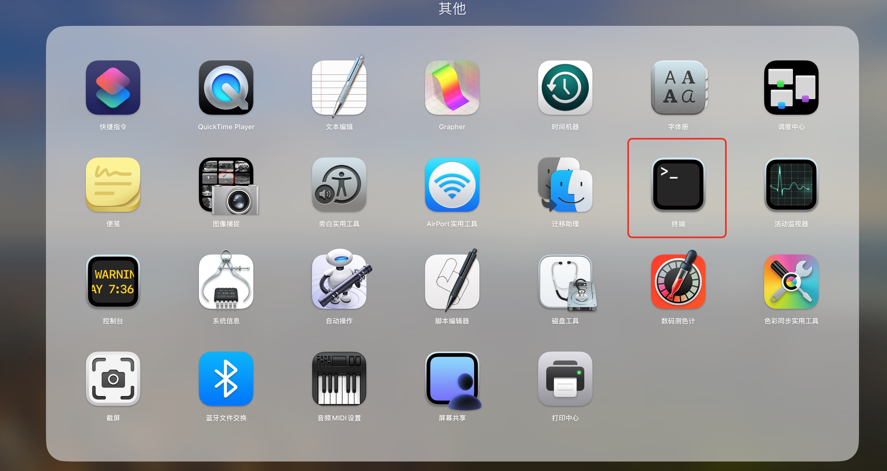</td>
<td></td>
</tr></table>

---

## 一、检查网络情况

Claude Code 的安装和使用依赖海外网络环境, 因此第一步需要确认网络连通性.

### 1.1 浏览器验证

1. 打开浏览器, 访问 https://www.google.com/
2. 如果**无法访问**, 请先完成 [附录：科学上网配置](#附录科学上网配置)
3. 如果**可以访问**, 打开科学上网工具中的 **"增强模式"** 或 **"虚拟网卡"**

<table><tr>
<td>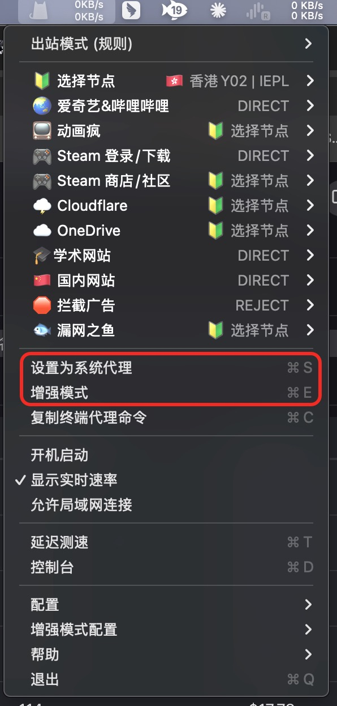</td>
<td></td>
</tr></table>

> 开启增强模式/虚拟网卡是为了让终端的流量也走代理, 否则浏览器能访问但终端可能不通.

### 1.2 终端验证

打开终端, 执行如下命令:

```bash
curl -i https://google.com
```

如果马上出现一连串的字符, 则代表终端网络已经连通.

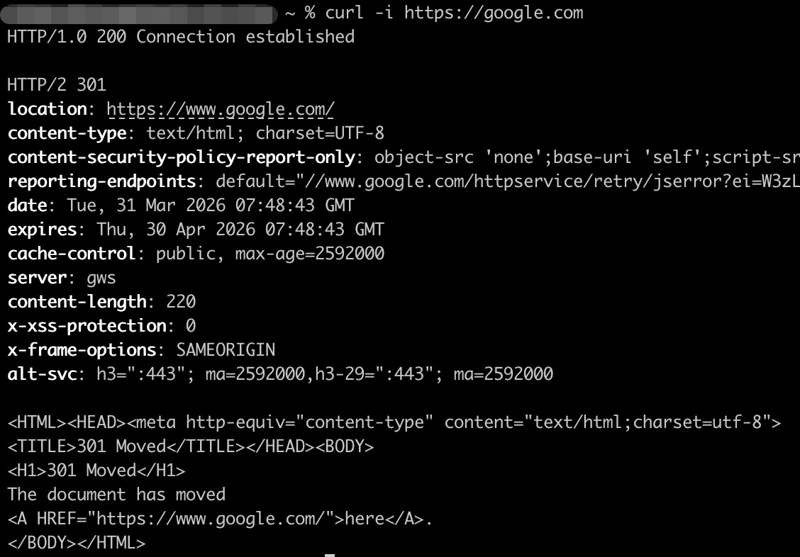

---

## 二、安装 iTerm2

iTerm2 是一款兼容性更好的终端工具, 可以避免中文乱码等问题, **推荐替代系统自带终端使用**.

### 2.1 下载

1. 浏览器访问 https://iterm2.com/
2. 点击页面上的黑色图标 **Download** 进行下载
3. 如果MacOS版本较老, 需要点击上方右侧的 **Downloads** , 再点击 **Show Older Versions** 选择对应版本下载

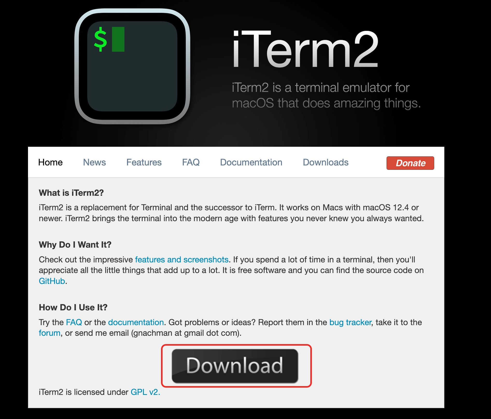

### 2.2 安装

1. 双击打开下载的 `.dmg` 文件
2. 将 iTerm 图标拖动到 **应用程序** 文件夹中即可
3. 如果出现下面的弹框, 选择中国大陆, 下方勾选后, 点击 **OK**

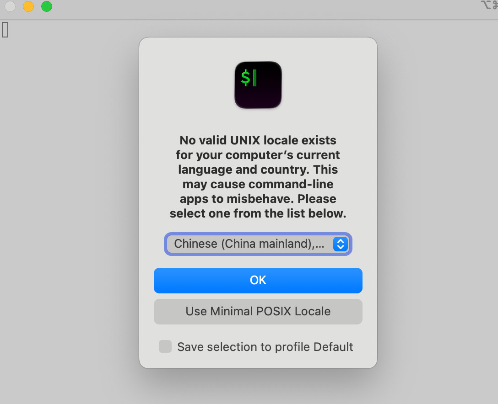

> 如果后续出现通知权限提示, 点击 **允许** 即可.

### 2.3 验证环境变量

后续安装步骤依赖 **zsh** 和 **`.zshrc`** 配置文件, 需要先确认环境已就绪.

#### 步骤一: 检查当前 Shell

在 iTerm2 中执行:

```bash
echo $SHELL
```

根据输出结果, 选择对应的操作:

- 输出 `/bin/zsh` → 前往 [步骤二](#步骤二-确认-zshrc-文件存在)
- 输出 `/bin/bash` → 前往 [步骤三](#步骤三-切换到-zsh仅-bash-用户)

#### 步骤二: 确认 .zshrc 文件存在

```bash
ls -a ~ | grep .zshrc
```

- 如果输出中看到 `.zshrc`, 则无需操作, 直接进入下一节
- 如果**没有输出**, 执行以下命令创建:

```bash
touch ~/.zshrc
source ~/.zshrc
```

> 完成后直接进入 [三、安装 CC-Switch](#三安装-cc-switch).

#### 步骤三: 切换到 zsh（仅 bash 用户）

1. 执行切换命令:

```bash
chsh -s /bin/zsh
```

> 系统会要求输入密码, 输入后回车即可（输入时不会显示字符, 属正常现象）.

2. **关闭并重新打开 iTerm2**, 使切换生效

3. 验证切换是否成功:

```bash
echo $SHELL
```

确认输出为 `/bin/zsh` 后, 创建配置文件:

```bash
touch ~/.zshrc
source ~/.zshrc
```

---

## 三、安装 CC-Switch

CC-Switch 是 Claude Code 的配置管理工具, 具备 Skills 管理、会话管理、API Key 管理等功能.

### 3.1 下载安装包

1. 浏览器访问 https://github.com/farion1231/cc-switch
2. 点击右侧的 **Releases**

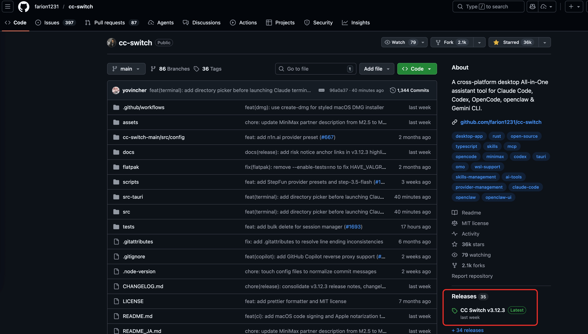

3. 滑动到页面最下方的 **Assets** 部分
4. 下载安装包: `CC-Switch-v.xx.xx-macOS.dmg`

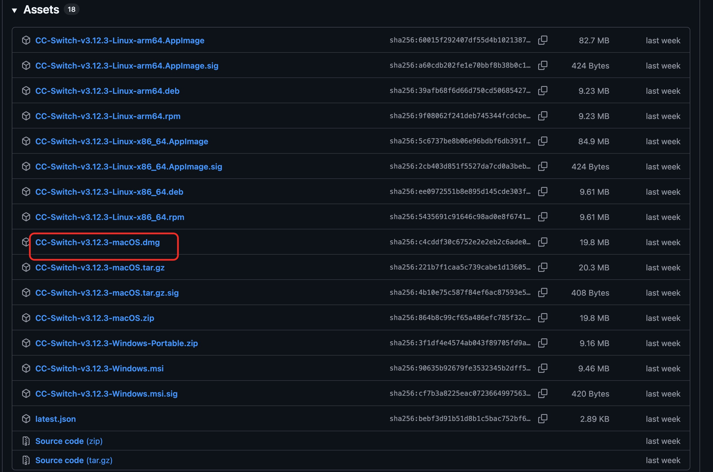

### 3.2 安装与配置

1. 双击打开安装包, 将图标拖动到 **应用程序** 中即可
2. 私信公司管理员, **获取 API Key**
3. 在 CC-Switch 中点击右上角的 **添加按钮**
4. 选择 **PackyCode**

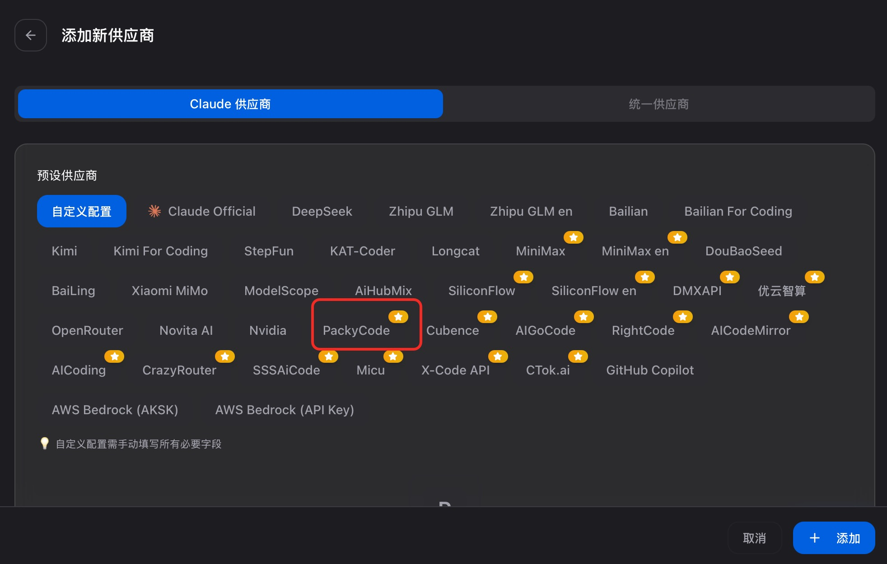

5. 下滑, 填入 Key, 点击右下角 **添加** 即可

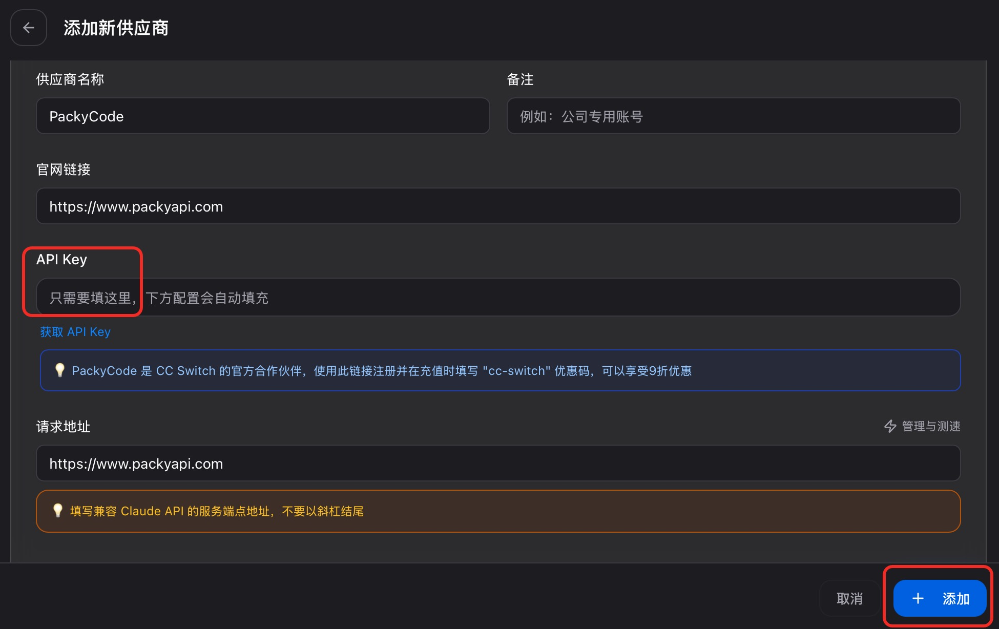

---

## 四、安装 Xcode Command Line Tools

Xcode Command Line Tools 提供了编译和安装所需的基础开发工具链, 是后续安装 Claude Code 的前置依赖.

> 需要注意, 如果是老版本的Mac, 整体下载需要20G的存储空间, 请确保有足够的磁盘空间后再执行安装.
> 同时安装耗时较长, 可能需要等待 30 分钟以上, 请耐心等待安装完成.

### 4.1 执行安装命令

在 iTerm2 中执行:

```bash
xcode-select --install
```

如果弹出安装窗口, 点击 **安装** 并等待完成即可.


> 如果输出以下内容, 则说明已安装过, 无需额外操作, 直接进入下一步:
>
> ```
> xcode-select: note: Command line tools are already installed. Use "Software Update" in System Settings or the softwareupdate command line interface to install updates
> ```

---

## 五、检查芯片类型

不同芯片类型的 Mac 安装方式略有不同, 需要先确认你的 Mac 芯片类型.

### 5.1 查看方式

1. 点击左上角 **苹果图标**
2. 选择 **"关于本机"** 选项

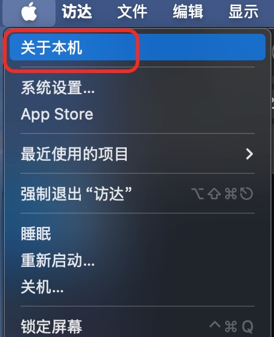

3. 在 **"概览"** 标签页中查看 **"芯片"** 信息

<table><tr>
<td>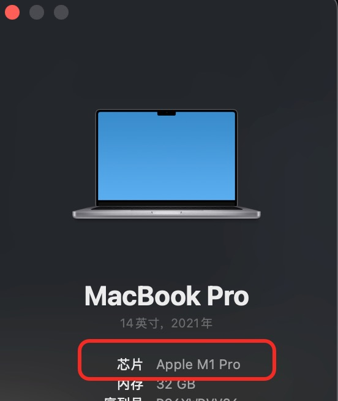</td>
<td>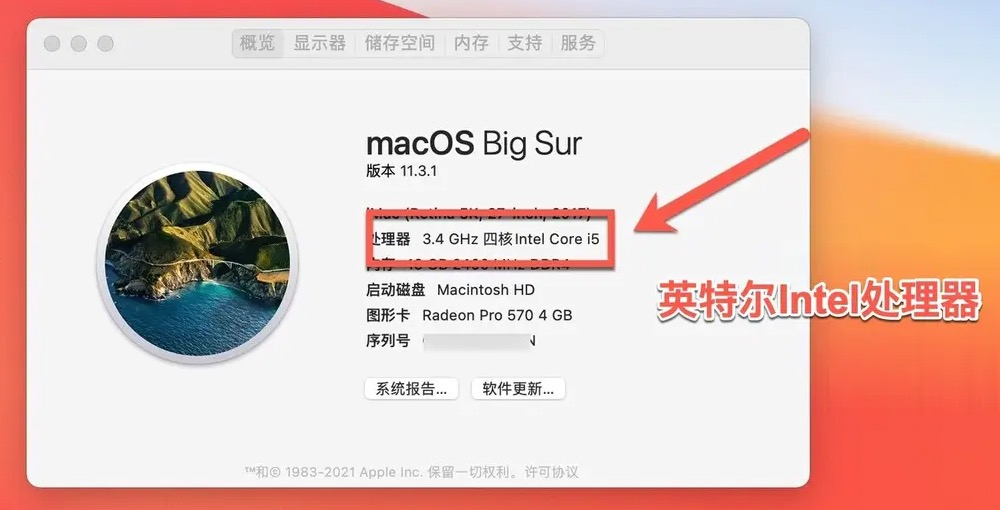</td>
</tr></table>

### 5.2 判断结果

- 如果显示为 **Apple M1 / M2 / M3 / M4** 等, 则是 M 芯片 → 前往 [六、M 芯片 Mac 安装步骤](#六m-芯片-mac-安装步骤)
- 如果显示为 **Intel**, 则是 Intel 芯片 → 前往 [七、Intel 芯片 Mac 安装步骤](#七intel-芯片-mac-安装步骤)

---

## 六、M 芯片 Mac 安装步骤

### 6.1 执行安装命令

在 iTerm2 中执行:

```bash
curl -fsSL https://claude.ai/install.sh | bash
```


> 开始下载后, 可以在科学上网工具中观察到有几 MB 的下载速度, 说明安装正在进行.

### 6.2 完成安装配置

1. 安装完成后, 终端会输出一段提示命令, 如果有下图红框部分, 则**复制该命令并执行一次**

```bash
 echo 'export PATH="$HOME/.local/bin:$PATH"' >> ~/.zshrc && source ~/.zshrc
```

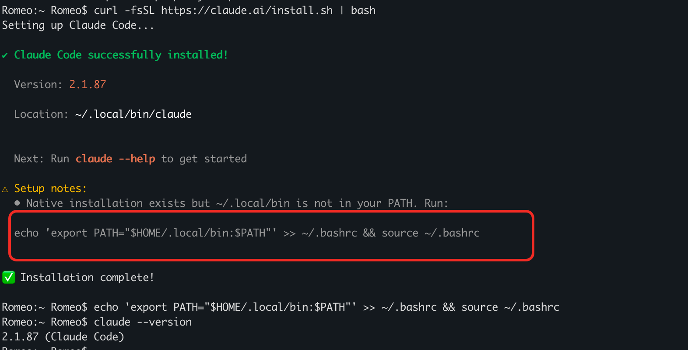

2. 验证安装是否成功:

```bash
claude --version
```

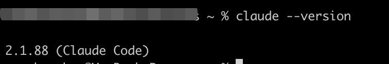

正确输出类似 `2.1.88` 的版本号, 则代表安装成功.

### 6.3 验证连通性

1. 启动 Claude Code:

```bash
claude
```

2. 发送 `ping`, 如果收到 `pong`, 则代表配置成功, 可以开始使用了


---

## 七、Intel 芯片 Mac 安装步骤

> Intel 芯片的 Mac 无法使用官方一键安装脚本, 需要通过 Node.js 的 npm 方式安装.

### 7.1 安装 nvm

nvm 是 Node.js 的版本管理工具, 在 iTerm2 中执行:

```bash
curl -o- https://raw.githubusercontent.com/nvm-sh/nvm/v0.39.7/install.sh | bash
```

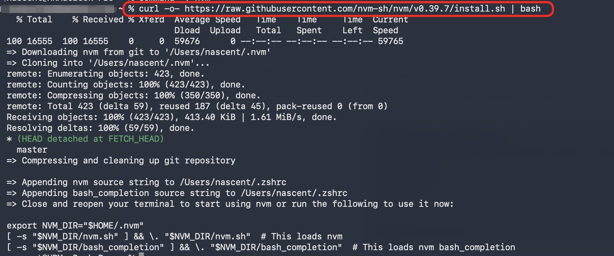

### 7.2 配置生效

使 nvm 的配置写入生效:

```bash
source ~/.zshrc
```

### 7.3 安装并指定 Node.js

1. 安装 LTS 版本:

```bash
nvm install --lts
```

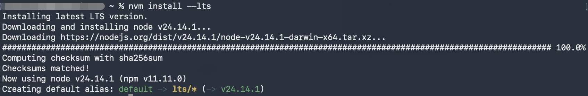

2. 指定使用 LTS 版本:

```bash
nvm use --lts
```


3. 验证 Node.js 路径:

```bash
which node
```

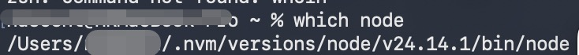

### 7.4 安装 Claude Code

```bash
npm install -g @anthropic-ai/claude-code
```

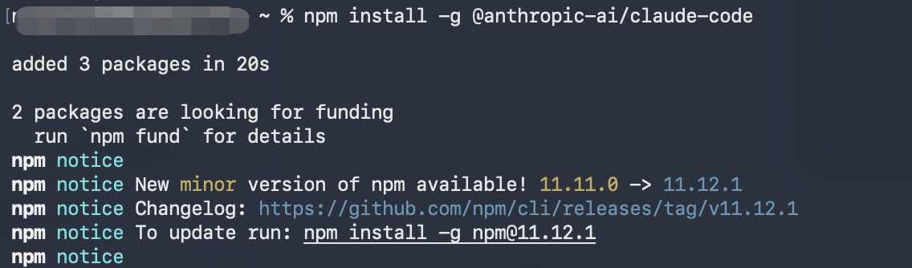

### 7.5 完成安装配置

1. 验证安装是否成功:

```bash
claude --version
```


正确输出类似 `2.1.88` 的版本号, 则代表安装成功.

### 7.6 验证连通性

1. 启动 Claude Code:

```bash
claude
```

2. 发送 `ping`, 如果收到 `pong`, 则代表配置成功, 可以开始使用了


---

## 附录：科学上网配置

如果你的网络无法直接访问 Google 等海外服务, 需要先配置科学上网工具.

### A.1 注册账号

1. 浏览器访问 https://ikuuu.nl/auth/register?code=2vS9
2. 注册一个账号


### A.2 购买套餐

1. 点击 **商店**, 购买一个月套餐即可（约 12 元）


### A.3 下载客户端

1. 点击 **下载与教程**, 选择 **Mac**

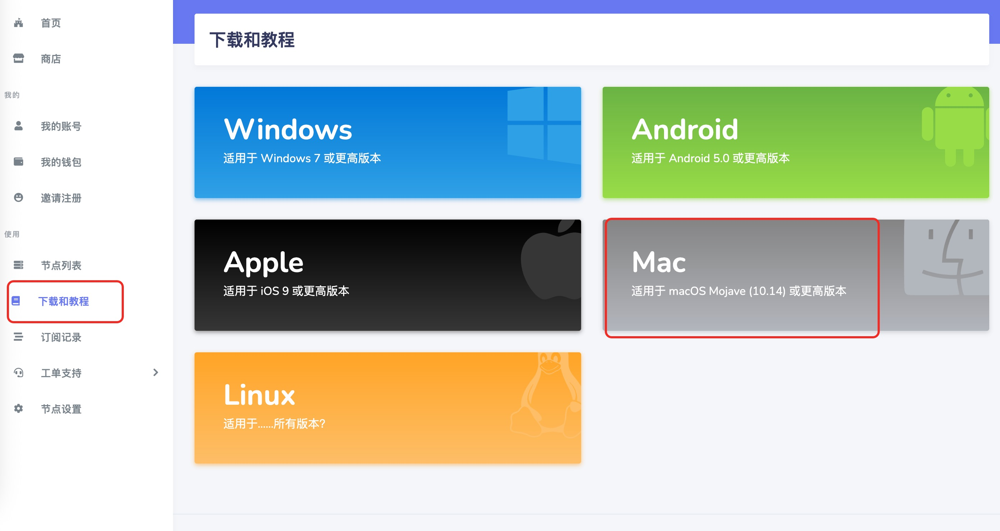

2. 点击 **下载客户端**


3. 下载完成后, 双击打开安装包, 拖动到 **应用程序** 中即可
4. 如果出现 "无法打开, 因为不是从 App Store 下载", 则前往 **设置 → 隐私与安全性**, 下拉可以看到:
   1. 安全性 → 允许以下来源的应用程序 → 选择 **App Store 与已知开发者**
   2. 安全性 → 点击 **仍要打开**

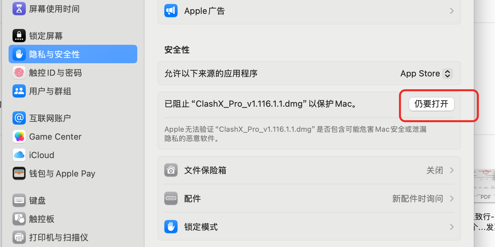

### A.4 配置与启用

1. 打开 **ClashX Pro**, 会弹框提示安装帮助程序, 输入密码安装即可
2. 回到浏览器页面, 点击 **一键导入**
3. 开启 **系统代理**

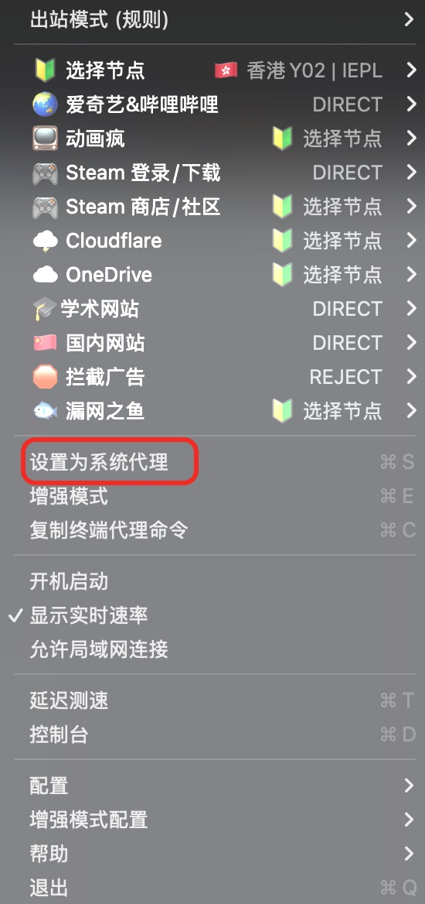

> 配置完成后, 返回 [一、检查网络情况](#一检查网络情况) 重新验证网络连通性.

---

## 疑难杂症

### Q1: Intel 芯片安装 nvm 时提示需要安装 Xcode Command Line Tools

**报错信息:**

```
You may be on a Mac, and need to install the Xcode Command Line Developer Tools.
If so, run 'xcode-select --install' and try again. If not, please report this!
```

**解决方案:**

请参考 [四、安装 Xcode Command Line Tools](#四安装-xcode-command-line-tools), 安装完成后重新执行 nvm 安装命令即可.

---

### Q2: 再次打开 iTerm2 执行 claude 时提示 command not found

> 如果已按照 [2.3 验证环境变量](#23-验证环境变量) 操作, 通常不会遇到此问题.

**报错信息:**

```
command not found: claude
```

**解决方案:**

执行以下命令重新加载配置:

```bash
source ~/.zshrc
```

---

### Q3: 执行 source ~/.zshrc 提示文件不存在

> 如果已按照 [2.3 验证环境变量](#23-验证环境变量) 操作, 通常不会遇到此问题.

**报错信息:**

```
source: no such file or directory: /Users/user/.zshrc
```

**原因:** 之前没有执行过相关命令, 系统中尚未生成 `.zshrc` 文件.

**解决方案:**

1. 先创建该文件:

```bash
touch ~/.zshrc
```

2. 验证文件是否创建成功:

```bash
ls -a ~ | grep .zshrc
```

如果看到 `.zshrc` 则代表创建成功.

3. 重新加载配置:

```bash
source ~/.zshrc
```

---

### Q4: 出现弹框提示 "pip3 命令需要命令行工具" 的安装提示

**解决方案:**

1. 点击 **取消**
2. 参考 [四、安装 Xcode Command Line Tools](#四安装-xcode-command-line-tools) 执行安装即可


