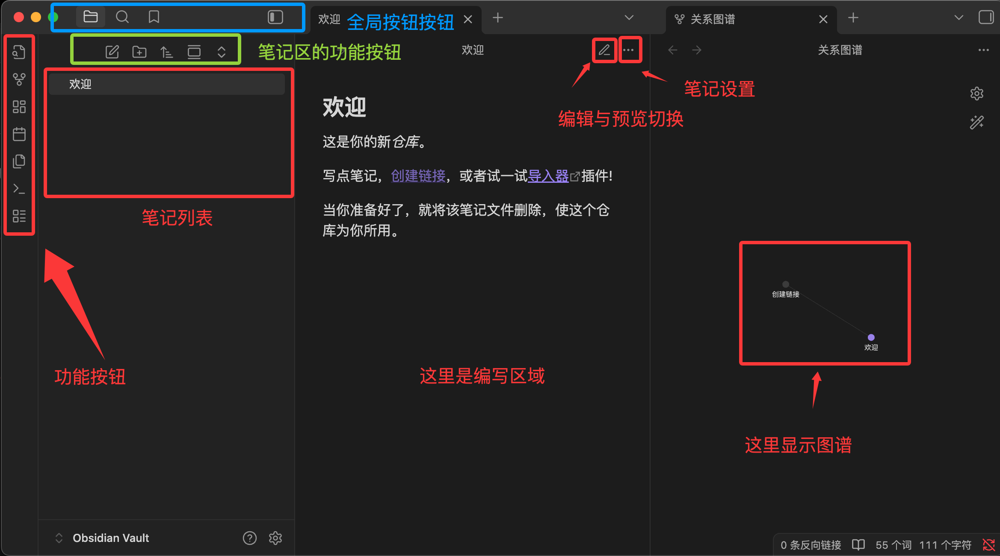
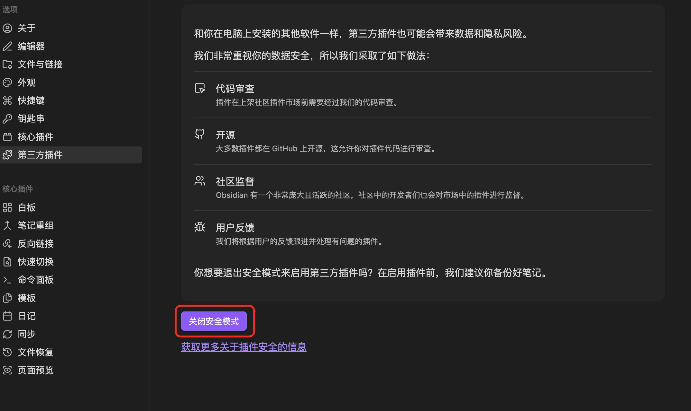
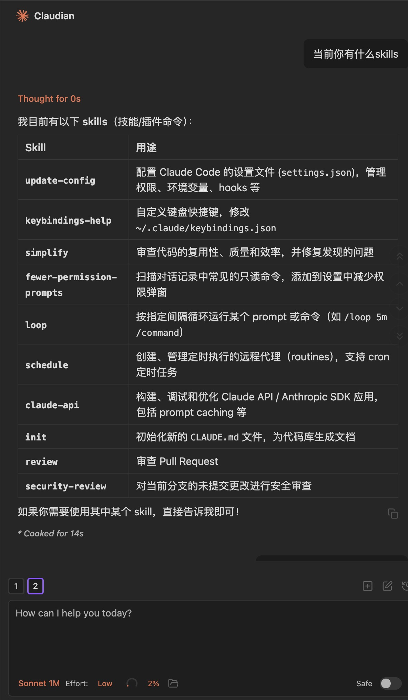

# Obsidian 使用白皮书

> **作者**: @Mzs | **日期**: 2026/4/28 | **版本**: v1.0.0
>
> GitHub: [github.com/Mzs-code/ai-wiki](https://github.com/Mzs-code/ai-wiki)

---

---

## 目录

- [摘要](#摘要)
- [一、为什么是 Obsidian](#一为什么是-obsidian)
- [二、快速开始](#二快速开始)
- [三、插件生态](#三插件生态)
- [四、双向链接与关系图谱](#四双向链接与关系图谱)
- [五、账号与数据](#五账号与数据)
- [六、总结与展望](#六总结与展望)
- [附录](#附录)

---

## 摘要

Obsidian 是一款**本地优先, 基于 Markdown, 以双向链接为核心**的知识管理工具. 它不替你做笔记, 但它把你已有的笔记**结构化, 可视化, 可联想**, 并通过开放的插件生态接入 AI 能力, 形成一个能持续生长的个人知识网络.

本白皮书围绕"安装, 使用, 插件, AI 接入"四条主线, 沉淀了一套可直接落地的 Obsidian 实践方案, 重点说明如何把 Obsidian 与 **Claude Code (claudian 插件)** 和 **Get 笔记**串联, 让笔记不只是被记录, 更被反复调用.

---

## 一、为什么是 Obsidian

### 1.1 Obsidian 的核心理念

| 理念 | 含义 |
|------|------|
| 本地优先 | 所有笔记以 Markdown 形式存储在本地目录, 不依赖服务器 |
| 双向链接 | 笔记之间通过 `[[ ]]` 互相引用, 自动维护反向链接 |
| 关系图谱 | 把链接关系可视化, 让知识结构变得可见 |
| 插件可扩展 | 核心功能精简, 复杂能力通过社区插件按需启用 |

> 一句话: **Obsidian 不替你思考, 但让你的思考可以被检索, 被复用, 被串联.**

### 1.2 本文目标

- 帮助零基础读者快速搭建可用的 Obsidian 工作空间
- 重点讲解 AI 时代下值得关注的插件生态 (尤其是 claudian 与 Get 笔记)
- 给出可直接复制的工作流, 而不是堆砌特性清单
- 补充说明双向链接, 关系图谱, 账号与数据等基础话题

---

## 二、快速开始

### 2.1 下载与安装

1. 访问官网: [https://obsidian.md/zh/](https://obsidian.md/zh/)
2. 根据自己的系统选择版本下载 (支持 macOS, Windows, Linux, iOS, Android)
3. 安装完成后直接打开, 无需注册

帮助文档: [https://obsidian.md/zh/help](https://obsidian.md/zh/help)

### 2.2 新建仓库 (Vault)

仓库 (Vault) 是 Obsidian 中最核心的概念:

> **一个 Vault = 一个本地目录 = 一个独立的工作空间**

仓库中包含的内容:

- 所有的 Markdown 笔记
- 引用的图片, 附件等素材
- 该仓库专属的插件与配置 (`.obsidian/` 目录)

操作步骤:

1. 打开 Obsidian, 选择"新建库"
2. 指定一个本地目录作为仓库根目录
3. 后续所有的笔记, 素材, 插件都基于这个空间隔离管理

> 建议: 个人使用时, 用一个长期仓库即可; 不要为每个项目都新建仓库, 否则会破坏知识之间的联想能力.

### 2.3 删除文件去哪了

不同系统下, Obsidian 删除的文件归宿不同:

| 系统 | 删除后位置 | 是否可恢复 |
|------|-----------|----------|
| macOS | 系统的废纸篓 | 是 |
| Windows | 仓库根目录下的 `.trash/` 文件夹 | 是 |

---

## 三、插件生态

Obsidian 自身只提供"最小可用集", 真正强大的能力来自**插件**. 插件分两类:

- **核心插件**: 官方内置, 在 `设置 → 核心插件` 中开启
- **第三方插件**: 社区贡献, 在 `设置 → 第三方插件` 中安装

> 启用第三方插件前, 需要先在 `设置 → 第三方插件` 中**关闭"安全模式"**.

本章是全文的重点. 真正让 Obsidian 在 AI 时代脱颖而出的, 是 **claudian** 和 **Get 笔记**这两个组合.

### 3.1 claudian: 把 Claude Code 装进 Obsidian

[claudian](https://github.com/YishenTu/claudian) 是 Claude Code 的 Obsidian 插件, 把对话, 工具调用, Skills 全部带入笔记侧, 是目前最值得关注的 AI 插件.

#### 3.1.1 安装步骤

1. 进入 `设置 → 第三方插件`, 关闭"安全模式"
2. 打开 [claudian releases 页](https://github.com/YishenTu/claudian/releases/latest), 下载 `main.js`, `manifest.json`, `styles.css` 三个文件
3. 点击"已安装插件"右侧的**文件夹图标**, 进入插件目录, 新建文件夹 `claudian`, 把上面三个文件放进去
4. 回到 Obsidian, 在第三方插件列表中**启用 claudian**
5. 启用后, 左侧侧栏会出现一个机器人图标, 点击即可与 Claude 对话

#### 3.1.2 配置建议

- 如果本机已经在使用 [cc-switch](https://github.com/farion1231/cc-switch) 管理 Claude API Key/OAuth, 则可以直接使用

#### 3.1.3 使用方式

- 用法与常规 Chat 区别不大, 输入框下方可切换**模型**和 **effort** (思考强度)
- 使用 `@` 可以引用当前仓库内的文件作为上下文, 这是它和外部 ChatBot 最大的不同
- 支持**多对话切换**和**历史对话管理**, 不用担心上下文丢失

> 价值: claudian 把"知识库 + AI 对话"从两个 App 合并为一个上下文, 笔记即语料, 对话即新笔记, 形成闭环.

### 3.2 Get 笔记: 录音与网页内容入口

[Get 笔记](https://www.biji.com/) 是一款非常好用的 AI 笔记工具, 主打:

- **录音转写**: 自动纠偏口癖词, 重复字, 输出可读性强的文本
- **网页 / 视频链接总结**: 直接粘贴 URL 即可获得结构化摘要

它本身不是 Obsidian 的插件, 而是作为**"内容前置入口"**与 Obsidian 配合, 主要解决"录音 / 长视频 / 网页"三类内容的快速入库.

#### 3.2.1 四种导入方式

| 方式 | 操作 | 适用场景 |
|------|------|---------|
| 方式 1 | 在 Get 笔记 Web 端导出 Markdown 文件, 放入仓库 | 偶尔同步, 无需自动化 |
| 方式 2 | 启用核心插件"网页浏览器", 在内嵌浏览器登录 [biji.com](https://www.biji.com/), 点击右上角三个点选"保存到仓库" | 想留在 Obsidian 内完成 |
| 方式 3 | 使用插件 [get-to-obsidian](https://github.com/geekhuashan/get-to-obsidian) (基于 Playwright 的自动同步) | 需要无人值守同步 |
| 方式 4 | 基于 Get 笔记开放平台 API, 用 Claude Code 写一个 **Skill**, 完成数据查询 + 本地落库 | 进阶玩法, 自定义程度最高 |

> 推荐: 偶尔使用选方式 1, 重度使用选方式 3 或方式 4, 后两者可以做到"录完即同步".

参考视频: [手搓一个 Claude Code Skill, 把 Get 笔记自动同步到 Obsidian](https://www.youtube.com/watch?v=04Ej2uY4wzI)

### 3.3 浏览器剪藏 (有保留)

官方推出的 [Obsidian Web Clipper](https://chromewebstore.google.com/detail/obsidian-web-clipper/cnjifjpddelmedmihgijeibhnjfabmlf) 提供了从浏览器一键剪藏到仓库的能力, 对应的开源链接是 [obsidian-clipper](https://github.com/obsidianmd/obsidian-clipper).

实际体验:

- **优点**: 可以快速把网页正文转 Markdown 写入仓库
- **痛点**: 图片保存效果一般, 如微信公众号需要拉到底加载完所有图片后再触发
- **替代**: 如果重度依赖图片, 建议先用 Get 笔记完成网页总结再同步, 或自行截图后插入

### 3.4 其他值得关注的插件

| 插件 | 用途 |
|------|------|
| [Dataview](https://github.com/blacksmithgu/obsidian-dataview) | 在笔记中以"类 SQL"语法查询自己的笔记, 自动生成清单, 表格, 图表 |
| [Text Generator](https://github.com/nhaouari/obsidian-textgenerator-plugin) | 通用 LLM 文本生成, 适合不绑定特定厂商的场景 |
| [CustomJS](https://github.com/saml-dev/obsidian-custom-js) | 在笔记中嵌入自定义 JS 函数, 配合 Dataview 可玩出很多花样 |
| [obsidian-rag](https://github.com/liaocaoxuezhe/obsidian-rag) | 基于仓库笔记构建本地 RAG 检索 |
| [微信同步助手](https://forum-zh.obsidian.md/t/topic/55536) | 把微信收藏的内容同步进 Obsidian |

> 选插件原则: **先用核心功能跑通再装插件**. 插件越多, 配置越复杂, 也越容易在版本升级时出问题.

---

## 四、双向链接与关系图谱

> 这一节是 Obsidian 区别于其他笔记软件的底层特性. 上面的插件能跑起来后, 真正能让笔记长成网络的, 是这两件事.

### 4.1 双向链接

双向链接是 Obsidian 的灵魂. 写法非常简单:

1. 在任意笔记中输入 `[[`, 编辑器会自动弹出仓库内可链接的笔记列表
2. 选择目标笔记, 例如 `[[B]]`, 即在 A 笔记中创建了指向 B 的链接
3. 反向地, B 笔记会**自动出现一条反向链接**, 提示"A 引用了我"

价值在于:

- **写的时候**: 想到相关概念顺手 `[[ ]]`, 不用打断思路去整理目录
- **读的时候**: 可以从任意一篇笔记出发, 顺着链接漫游, 重新发现旧知识

### 4.2 关系图谱

关系图谱 (Graph View) 是双向链接的可视化呈现:

- **节点**: 每一篇笔记都是一个节点
- **边**: 两篇笔记之间存在 `[[ ]]` 链接, 就有一条边
- **聚类**: 围绕同一主题的笔记会自然形成一团

关系图谱的两个用法:

1. **结构发现**: 看清自己的知识分布, 找出"孤岛笔记"和"枢纽笔记"
2. **导航工具**: 当你不记得某篇笔记叫什么但记得它和哪些主题相关时, 直接在图谱中跳转

> 提示: 仓库笔记数量较少时图谱意义不大, 真正发挥作用大约需要积累 100+ 篇互相引用的笔记.

### 4.3 Markdown 与轻量编辑

Obsidian 的所有笔记都是标准的 `.md` 文件, 这意味着:

- 笔记可以直接用任何文本编辑器打开
- 不存在"专有格式锁定", 想迁移随时迁移
- 与 Git, Claude Code, Cursor 等开发者工具天然兼容

---

## 五、账号与数据

Obsidian 在数据所有权上的处理非常清晰:

| 场景 | 是否需要账号 | 是否收费 |
|------|------------|---------|
| 下载与本地使用 | 不需要 | 免费 |
| 多端设备同步 (Obsidian Sync) | 需要 | 付费增值 |
| 文章在线发布 (Obsidian Publish) | 需要 | 付费增值 |

> 也就是说, **完全免费 + 数据完全在自己手里** 是 Obsidian 的默认状态. 仅当需要官方提供的同步或发布服务时才需要注册和付费.

替代方案: 如果不想付费但又需要多端同步, 可以把仓库目录放在 iCloud, OneDrive, Dropbox, 或者 Git 仓库中, 同样能实现跨设备同步.

---

## 六、总结与展望

回顾全文, 几个要点值得反复强调:

1. **数据主权**: Obsidian 选择本地优先, 笔记永远是你自己的 Markdown 文件, 任何时候都可以迁移
2. **双向链接 > 文件夹**: 知识真正的价值在联想, 而不在分类. 越早适应 `[[ ]]`, 越早摆脱目录陷阱
3. **关系图谱是结果不是目的**: 不要为了图谱好看而硬连接, 自然形成的网络才有意义
4. **插件按需启用**: 核心功能用熟之前, 不必追求"全家桶". 装得越多, 维护成本越高
5. **AI 接入是新阶段**: claudian + Get 笔记 + Skills 的组合, 让 Obsidian 从"被动记录"升级为"可对话的知识引擎"
6. 在 AI 时代, **个人知识库的复利价值远高于单次对话**. Obsidian 是当前为数不多兼顾"开放, 本地, 可扩展"的选择

---

## 附录

### 附录 A: 术语表

| 术语 | 说明 |
|------|------|
| Vault | 仓库, Obsidian 的工作空间, 对应一个本地目录 |
| 双向链接 | 用 `[[笔记名]]` 在笔记之间建立互相引用的链接 |
| 反向链接 | 系统自动维护的"哪些笔记引用了我" |
| 关系图谱 | 双向链接的可视化呈现, 节点是笔记, 边是链接 |
| 核心插件 | Obsidian 官方内置, 默认未全部启用 |
| 第三方插件 | 社区贡献, 启用前需关闭"安全模式" |
| Skill | Claude Code 中以自然语言定义的可复用能力 |
| RAG | Retrieval-Augmented Generation, 检索增强生成 |

### 附录 B: 常用链接清单

**官方资源**

- 官网: [https://obsidian.md/zh/](https://obsidian.md/zh/)
- 帮助文档: [https://obsidian.md/zh/help](https://obsidian.md/zh/help)
- 官方剪藏插件: [obsidian-clipper](https://github.com/obsidianmd/obsidian-clipper)

**AI 与同步类插件**

- claudian: [https://github.com/YishenTu/claudian](https://github.com/YishenTu/claudian)
- get-to-obsidian: [https://github.com/geekhuashan/get-to-obsidian](https://github.com/geekhuashan/get-to-obsidian)
- Text Generator: [https://github.com/nhaouari/obsidian-textgenerator-plugin](https://github.com/nhaouari/obsidian-textgenerator-plugin)
- obsidian-rag: [https://github.com/liaocaoxuezhe/obsidian-rag](https://github.com/liaocaoxuezhe/obsidian-rag)
- 微信同步助手: [https://forum-zh.obsidian.md/t/topic/55536](https://forum-zh.obsidian.md/t/topic/55536)

**展示与扩展类插件**

- Dataview: [https://github.com/blacksmithgu/obsidian-dataview](https://github.com/blacksmithgu/obsidian-dataview)
- CustomJS: [https://github.com/saml-dev/obsidian-custom-js](https://github.com/saml-dev/obsidian-custom-js)

**配套工具**

- Get 笔记: [https://www.biji.com/](https://www.biji.com/)
- Obsidian Web Clipper: [https://chromewebstore.google.com/detail/obsidian-web-clipper/cnjifjpddelmedmihgijeibhnjfabmlf](https://chromewebstore.google.com/detail/obsidian-web-clipper/cnjifjpddelmedmihgijeibhnjfabmlf)

**学习资料**

- [Obsidian 入门 (知乎)](https://zhuanlan.zhihu.com/p/2010817934558269814)
- [知识管理的工业革命: 卡片盒笔记法](https://mp.weixin.qq.com/s/7CVtrAjaIfhIUSbBpgKhOQ)
- [手搓一个 Claude Code Skill: 把 Get 笔记自动同步到 Obsidian (YouTube)](https://www.youtube.com/watch?v=04Ej2uY4wzI)
- [菜鸟教程 - Obsidian 安装教程](https://www.runoob.com/markdown/obsidian-tutorial.html)
- [菜鸟教程 - Obsidian Claude Code 插件使用教程](https://www.runoob.com/markdown/obsidian-claude-code.html)
