# AI 生态演变与企业应用白皮书

> **作者**: @Mzs | **日期**: 2026/3/30 | **版本**: v1.0.0
>
> GitHub: [github.com/Mzs-code/ai-wiki](https://github.com/Mzs-code/ai-wiki)

---

## 目录

- [摘要](#摘要)
- [一、前言](#一前言)
- [二、基础概念](#二基础概念)
- [三、生态演变](#三生态演变)
- [四、工具发展](#四工具发展)
- [五、总结与展望](#五总结与展望)
- [附录](#附录)

---

## 摘要

过去一年, AI 技术以前所未有的速度渗透至企业的各个业务环节. 面对层出不穷的大模型与工具, 企业和个人普遍感到焦虑与迷茫.

本白皮书从最基础的 LLM 交互原理出发, 系统梳理了从**提示词工程**到**上下文工程**的技术演进脉络, 并结合 Claude Code、MCP 协议、Skills 技能生态以及 OpenClaw 等前沿工具的实践经验, 为企业全员提供一套清晰的 AI 认知框架与落地方法论.

核心观点是: AI 的本质始终是"提示词 → LLM → 回答", 掌握了这条基础链路和上下文管理的核心能力, 就能驾驭不断更新的工具生态, 而非被其裹挟.

---

## 一、前言

### 1.1 行业现状与焦虑根源

当前 AI 领域的变化速度令人目不暇接:

1. **模型迭代极快**: 每天都有新的、更强的模型发布——OpenAI、DeepSeek、Claude、Gemini 轮番登场, 前一个还没看懂, 下一个更强的又来了.
2. **信息噪音过大**: 大量的 AI 资讯和营销噱头充斥网络, "一人公司赚 100 万"、"再不学就迟了"、"2 个 AI 顶 10 个员工"等标题让人焦虑不已.
3. **工具选择困难**: A 工具很好, B 工具也很强, 每个都号称"必学", 让人不知所措.

然而, 这种焦虑在很大程度上是不必要的. 在某种程度上, **只要你语言表达能力到位, 有逻辑思维, 就已经具备了使用和用好 AI 的基础能力**. 至于新的模型和工具, 只是不断迭代的"更好的工具", 让使用者更加省心, 并不断拓展更多的应用场景.

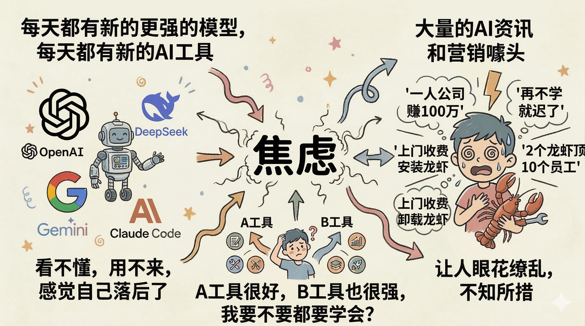

### 1.2 本文的目标

本白皮书并非教读者如何安装某个特定工具或"一键搞定 AI", 而是帮助读者:

- **建立对 AI 的认知框架**: 理解底层原理, 不被表象迷惑
- **掌握实操的工具和方法论**: 知道 AI 能在哪里帮到自己, 能帮到什么程度
- **达到"知其然并知其所以然"**: 在实践中形成适合自己的 AI 使用方法

---

## 二、基础概念

在深入探讨之前, 需要先对几个最核心的基础概念达成一致的认知.

### 2.1 LLM 的核心交互模式

大语言模型(LLM)最基本的交互方式可以用一条简单的链路概括:

> **提示词(Prompt) → LLM → 回答(Response)**

无论是在 DeepSeek 还是豆包中, 用户提出需求, 模型给出回答——这就是最核心的概念. 后续所有复杂的应用和架构, 都建立在这条基础链路之上.

### 2.2 上下文与"记忆"的真相

LLM 本质上是**无状态(Stateless)**的, 它没有真正的记忆. 那为什么我们可以在对话中不断提问、不断修正结果呢?

答案是: 每一次新的对话, 系统实际上会**把之前的对话历史带入新的请求中**, 从而形成一个看似连续的对话流. 但这种机制存在天然的限制——**上下文空间是有限的**. 当对话过长时, 模型会出现"大海捞针"效应: 对文本开头和结尾的信息提取精准, 但容易遗漏隐藏在长文档中间位置的细节信息.

> 这个概念非常重要, 它直接决定了后续章节中"上下文工程"为何如此关键.

### 2.3 Agent: 目标驱动的自主执行循环

Agent 是近一年 AI 领域最热门的概念之一. 与传统的人机对话相比, Agent 的核心区别在于**自主性**:

- **传统对话模式**: 用户给出目标, 但中间需要不断提问、不断调整, 一步步引导模型完成任务.
- **Agent 模式**: 用户给定一个目标, Agent 能**自主思考(Reasoning)、拆解任务(Planning)、调用工具(Acting)**, 并根据工具返回的结果**观察(Observation)**调整下一步行动, 直到完成闭环. 遇到不确定的地方, 它会主动反问用户, 让用户做选择题.

这就是所谓的 **ReAct(Reasoning + Acting)** 框架. 只有把 Agent 提升到"目标驱动的自主循环"这个高度, 才能将其与普通的"自动化脚本 + API 调用"彻底区分开来.

---

## 三、生态演变

### 3.1 提示词工程: 从入门到框架化

#### 三个进阶阶段

在 ChatGPT 和 DeepSeek 刚出来的时候, 大家都在研究怎么写好提示词. 提示词工程的发展大致经历了三个阶段:

- **初级阶段**: 直接描述需求. 例如: "帮我写一篇关于 AI 在企业应用的演讲稿."
- **进阶阶段**: 增加约束和结构. 例如: "帮我写一篇关于 AI 在企业应用的演讲稿, 要求包含基础概念、概念演变和应用三个部分."
- **框架化规约**: 使用结构化规范(如 LangGPT)来系统化地编写提示词, 定义角色、技能、背景、目标、输出格式、规则和工作流程等.

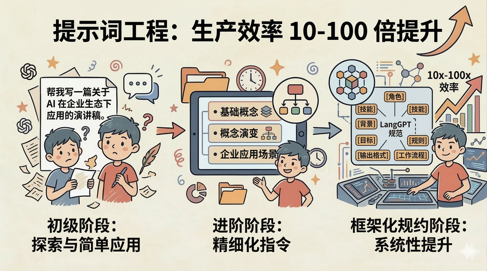

#### LangGPT: 结构化提示词规范

可能有人会问: 如此复杂的结构化提示词, 我也写不来啊? 实际上, **只有你才能写出好的提示词**, 因为你对自己的业务最专业、最清楚其中的细节和执行顺序. 至于格式化输出, 已经有非常成熟的工具可以辅助完成.

[LangGPT 提示词专家](https://chatgpt.com/g/g-Apzuylaqk-langgpt-ti-shi-ci-zhuan-jia) 是一个广泛应用的结构化提示词规范, 各主流大模型厂商均已支持. 下图展示了一个标准的 LangGPT 提示词示例:

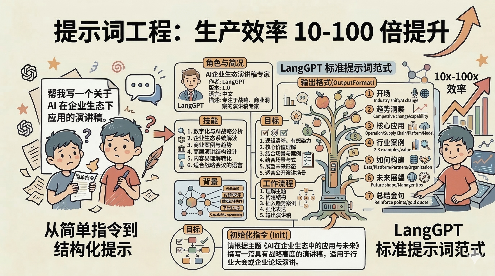

#### 企业早期落地案例

在提示词工程阶段, 某企业已经实现了多个实际落地应用:

1. **AI 智能文档助手**: 基于企业即时通讯平台的 AI 能力, 编写语义维度拆分与内容风控规则的提示词, 构建企业知识库问答助手.
2. **会员体系初始化专家**: 基于客户用户等级协议与业务系统, 通过提示词自动化完成会员体系的初始化配置.
3. **接口调试与日志查询助手**: 基于低代码 AI 平台, 只需输入请求 ID 即可自动定位系统日志和相关异常.
4. **数据需求确认**: 对数据分析需求进行评判和分析, 降低需求噪音, 提升需求质量.

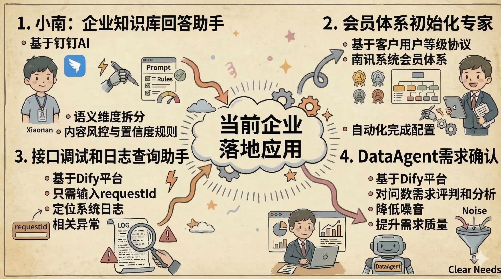

#### 阶段性结论

基于提示词工程的实践, 可以得出以下结论:

1. **核心价值**: 高质量的提示词可以带来更精准、更有价值的回答, 更是约束模型边界、提升输出"确定性"的关键. 它能将不可控的聊天工具转变为可靠的生产力组件.
2. **上手无门槛**: 无需学习编程, 自然语言即是代码. 业务人员也能直接参与到 AI 应用的构建中.
3. **迭代效率极高**: 可以随时调试、随时编辑(增加规则、增加示例、调整输出格式). 相比传统软件工程"编写-编译-部署"的漫长链路, 提示词只需修改文本即可.
4. **工程挑战**: 提示词中加入更多的规则、背景和示例, LLM 的产出就一定越好吗? 这引出了一个关键问题——**上下文管理**.

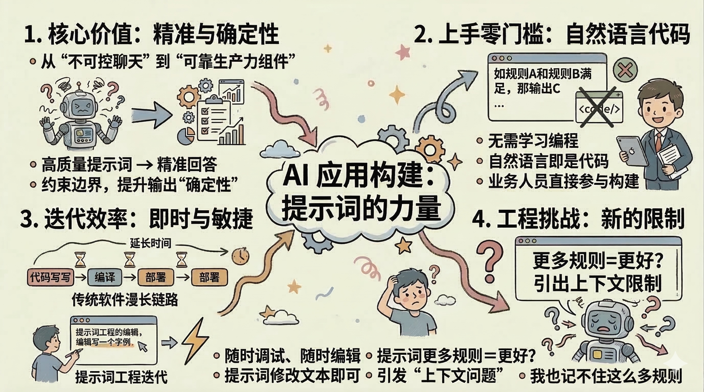

### 3.2 上下文工程: 突破提示词的天花板

随着对提示词的深入研究, 人们逐渐发现: 提示词虽然重要, 但即使再好的提示词, 对话时间过长也容易出现幻觉或降智现象. 这并非提示词本身的问题, 而是 **LLM 的上下文空间是有限的**.

#### 为什么上下文空间总是不够用

以 DeepSeek-V3 为例, 其 128K 的上下文长度, 大约等于 15 万到 20 万个中文字符(相当于一本 300-400 页的长篇小说). 看起来很多, 但在实际应用中远远不够:

1. **"大海捞针"效应(Lost in the Middle)**: 在接近极限长度时, 模型的 Attention(注意力)机制在处理超长文本时呈现"U 型特征"——首尾信息权重高, 中间信息被稀释, 容易遗漏关键细节.
2. **信息冗余**: LLM 本质无状态, 多轮对话中的"记忆"其实是把历史对话全量重新发送给模型, 产生大量重复信息.
3. **系统占用**: LLM 本身的系统提示词、工具调用(Function Calling)的 Schema 描述等也会占据大量上下文空间.
4. **企业级数据的庞大**: 企业应用往往会塞入大量的业务信息和文档, 但其中可能只有 5% 是解决当前问题所需的, 剩下的 95% 都在干扰模型的判断并消耗算力成本.

因此, 在 LLM 的上下文窗口不会指数级增长的前提下, **在相同的成本下, 如何高效利用有限的上下文空间就成为了关键问题.**

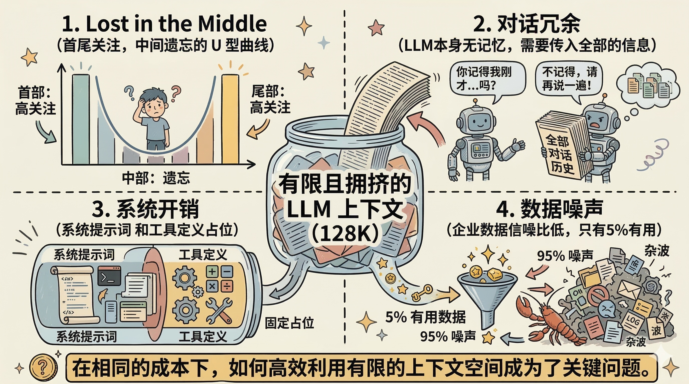

#### 六层架构: 如何高效利用上下文

上下文工程不是简单地"塞信息进 prompt", 而是 Agent 开发的核心能力. 其关键区别在于: **提示词工程关注"怎么说"(措辞格式), 上下文工程关注"看到什么"(信息选择与结构)**. 本质是构建大模型的工作记忆——用最小的高信噪比 token 集合决定决策质量.

上下文工程可以抽象为六层架构:

| 层级 | 策略 | 说明 |
|------|------|------|
| 1. 压缩重启 | 上下文近窗口上限时, 模型自动做摘要总结 | 用摘要初始化新窗口, 清理工具调用, 只保留结论 |
| 2. 外化记忆 | 用文件系统持久化记忆 | 将关键信息写入 Todo List / NOTES.md, 需要时从文件读取 |
| 3. 即时加载 | 上下文里放路径/链接, 而非信息本身 | 需要时使用工具加载, 用完就清理. 放的不是信息, 而是获取信息的能力 |
| 4. 上下文隔离 | 多 Agent 架构拆分任务 | 子 Agent 独立上下文, 避免互相干扰 |
| 5. 工具设计 | 精简工具集, 防止决策退化 | 用 logits masking 隐藏非当前工具, 保持缓存完整 |
| 6. 缓存架构 | 系统指令作固定前缀 | 新内容追加末尾, 最大化 KV cache 命中率, 可降本 90% |

加分策略: 保留错误信息作为学习信号, 每步刷新 Todo list 至上下文末尾以对抗注意力衰减.

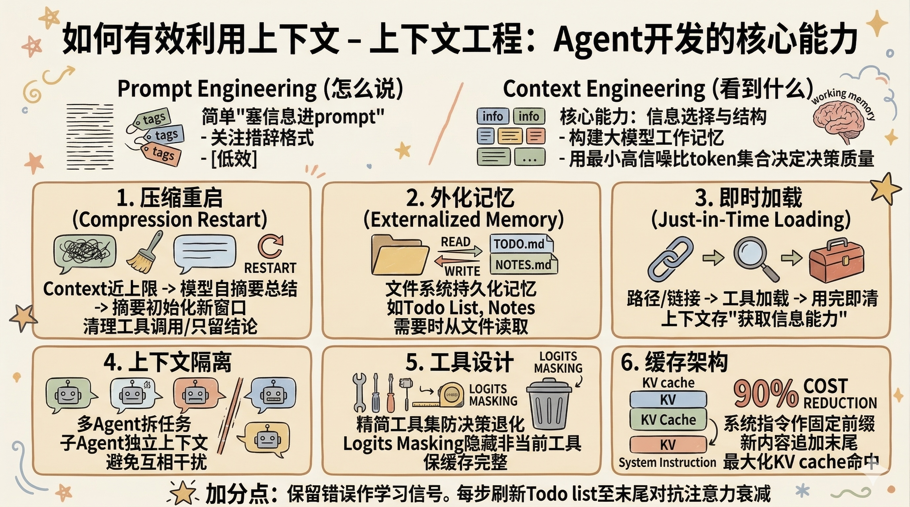

#### 规则太多, 怎么办?

上述六层架构涉及大量的规则和最佳实践, 在日常使用中难以一一记住. 那么, **有没有更好的办法, 既能使用 Agent 的能力, 又能让它自己去遵循和管理这些规则?**

这就引出了下一章节的核心话题——工具生态的发展, 特别是以 Claude Code 为代表的新一代 AI 工具, 正是为了解决这个问题而生.

---

## 四、工具发展

### 4.1 Claude Code: 最佳的上下文工程实践

#### Anthropic: 坚守安全边界的 AI 公司

作为 Claude Code 的母公司, Anthropic 在大模型赛道中有着极其鲜明的定位:

- **核心背景**: 由前 OpenAI 核心研发团队(Dario Amodei 等人)出走创立. 因在 AI 发展速度与安全理念上与 OpenAI 产生分歧, 团队决定另起炉灶.
- **极致的安全执念**: 首创"宪法 AI"(Constitutional AI), 将模型安全性、对齐(Alignment)和能力边界放在首位, 确保 AI 的"有用、诚实、无害"(HHH 原则).
- **对华政策**: 在地缘政治和数据安全合规方面极为严格, 对中国大陆市场采取封锁策略.

#### 商业数据与行业影响

自 2025 年 2 月 24 日正式发布以来, Claude Code 以摧枯拉朽之势重塑了全球开发者的工作流, 从单一的编程辅助工具进化为跨领域的底层智能引擎.

**呈指数级爆发的商业数据:**

- ARR(年度经常性收入): 2025 年 9 月达 5 亿美元, 仅隔一月翻倍至 10 亿, 2026 年 1 月突破 25 亿美元——创造了 SaaS 史上的增长奇迹.
- 代码生成占比: 全球 GitHub 公共代码提交中, 约 4% 已由 AI 生成; 在 Anthropic 内部, 80%-90% 的代码完全由 Claude Code 完成.

#### 开创性的技术架构

Claude Code 的成功不仅依赖于底层模型, 更在于其重新定义了 AI 与真实世界的交互协议:

- **MCP(模型上下文协议)**: 彻底打通了大模型与传统软件/本地环境的次元壁. 它让 Claude Code 能够无缝读取本地文件、数据库和开发工具, 将"云端大脑"与"本地双手"完美结合.
- **Skills(技能生态)**: 开发者可以像拼乐高一样为 Claude Code 赋予新技能, 极大地提升了 Agent 的覆盖范围与自发传播能力.
- **行业标准确立**: MCP 与 Skills 体系一经推出便引发全行业拥抱, 竞争对手为避免被边缘化, 被迫在第一时间宣布支持这些协议.

#### 底层基座: Claude Opus 4.6 的统治力

Claude Code 的强大直接建立在 Opus 4.6 模型的基础之上. 该模型在逻辑推理、超长上下文一致性和代码生成准确率上呈现出对同行的全面领先.

由于 Claude Code 的协议已成为事实上的行业标准, 国内的大模型厂商(如通义、文心、智谱等)纷纷在 API 层面兼容 Claude Code 的调用协议, 以维持与主流开发者生态的连接.

#### 使用体验

在实际应用中, Claude Code 摒弃了繁琐的图形界面, 回归开发者最熟悉的终端(Terminal):

- **命令行驱动**: 通过简单的终端指令即可在项目目录下唤醒.
- **自主规划与执行**: 只需用自然语言输入需求(例如: "帮我重构这个支付模块并加上单元测试"), 它会自主阅读相关代码, 理解上下文, 编写代码, 运行测试.
- **闭环修复**: 如果测试报错, 它会自动读取错误日志并自我修复, 直到任务完成, 全程无需人类频繁介入.

从某企业内部的推广经验来看, 大多数员工基本上 2 分钟就能学会基本操作, 2 天内即可完全独立使用, 1 周内便形成了自己的使用习惯和稳定产出.

### 4.2 MCP 与 Skills: 企业 AI 的基础设施

#### MCP(模型上下文协议)

在 MCP 出现之前, Agent 只能调用本地工具, 能力被锁死在一台机器里. MCP 的出现彻底改变了这一局面:

1. **定义**: MCP 是 AI 世界的"万能门禁卡". 有了它, Agent 可以跳出本地沙箱, 直接对接远程能力——数据库查询、地图服务, 甚至企业内部的业务系统, 统统一卡通行.
2. **核心价值**: 打通企业数据孤岛. 以某企业的实际业务为例, 通过 MCP 让 AI 直接读取 ERP 数据, 调用 CRM 接口, 自动串联客户数据与内部管理系统, 完成跨部门的自动化任务流——以前需要多个系统来回切换、人工搬运的事情, 现在一个 Agent 就能闭环.

#### Skills(技能资产)

Skills 的本质只有两个字: **文字**. 这意味着三件至关重要的事:

1. **零门槛创建**: 以往的工具是代码, 需要程序员开发. 而 Skills 用自然语言描述工具的使用方法和能力——写提示词的人就能写 Skills. 看不懂? 直接问 AI, 它会帮你写.
2. **病毒式传播**: 因为只是文字, 复制粘贴即可分享. Skills 概念提出仅 2 周, 社区就涌现了 20 万个 Skills, 覆盖财务、人力、数据分析、设计等各行各业.
3. **持续可迭代**: 每个人都可以像编辑提示词一样, 对 Skills 进行调试、修改和优化, 没有编译部署的负担.

#### MCP + Skills = 企业 AI SOP

当 MCP 和 Skills 结合, 就构成了企业级 AI 自动化的完整方案:

| 维度 | MCP | Skills |
|------|-----|--------|
| 解决的问题 | "能不能连上" | "知不知道怎么做" |
| 赋予 Agent 的能力 | 双手(执行能力) | 大脑(流程知识) |

两者缺一不可: 没有 Skills, Agent 连上了系统却不知道该干嘛; 没有 MCP, Agent 懂流程却碰到系统调用就卡住. 二者结合后, Skills 定义业务流程, MCP 在每一步提供系统调用能力——Agent 既懂流程, 又能执行, 实现端到端闭环.

**企业级意义**: 从"人记 SOP"到"AI 执行 SOP". 组织知识通过 Skills 固化为流程, 通过 MCP 接入业务系统. 知识不再锁在个人脑中, 而是沉淀为组织的数字能力.

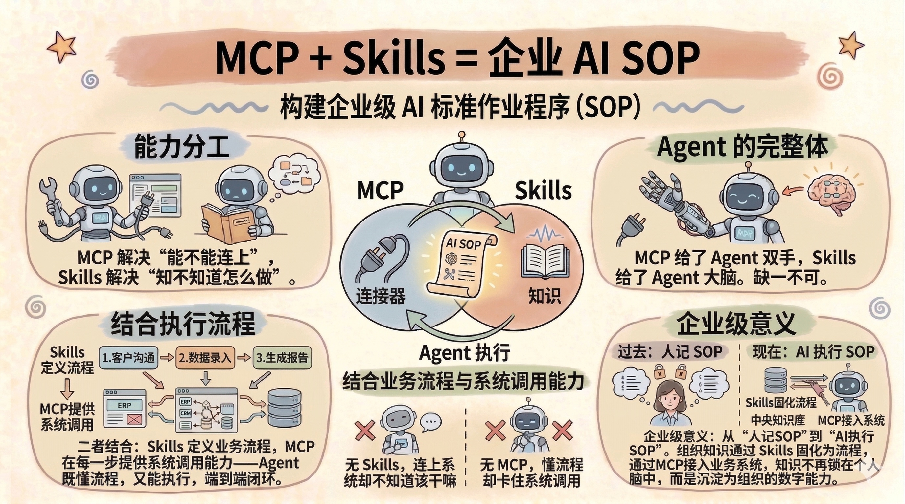

### 4.3 不止是开发者的工具: 企业全角色提效场景

虽然 Claude Code 的名字中带有"Code", 但由于大模型的智能水平和 Agent 能力的大幅提升, 它早已不再是一个纯粹的编程工具. 当前各行各业都在使用, 金融、法律、电商等领域的从业者已经在用它替代传统的 SaaS 工具.

在企业生态中, 几乎每个岗位都能从中受益:

| 角色 | 应用场景 |
|------|---------|
| **文档与信息处理** | 快速总结长篇财报、政策文件; 查找错别字与逻辑漏洞; 从文章中提取内容并结构化输出为表格或图表 |
| **产品设计** | 通过截图 + 标注的方式, 让 AI 直接生成 UI 原型, 甚至输出可点击的交互页面 |
| **商务支持** | 比对标书文件, 检查合规性、格式错误及条款缺失; 辅助定价策略分析 |
| **运营与内容** | 批量处理大量行业资讯; 辅助竞品分析、内容优化和文章结构调整 |

这些场景的共同特点是: **不需要写代码, 只需要用自然语言描述需求**, AI 就能调用本地工具完成任务. 这也是上下文工程真正走向企业全员的关键一步.

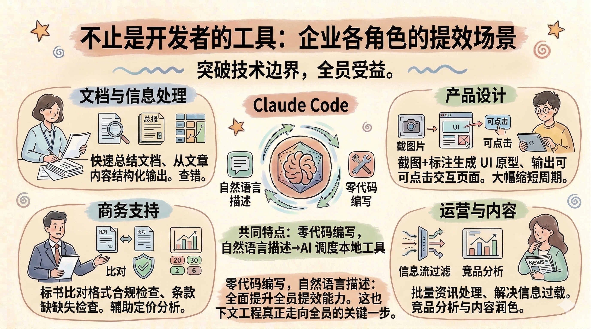

### 4.4 企业使用现状

以某企业为例, Claude Code 的内部推广情况如下:

1. 企业提供了统一的 API Key 管理和计费体系.
2. 从内测启动到日常使用, 日均消耗呈稳步增长态势.
3. 当前使用者中, 除研发人员外, 还包括产品、人事、市场等多个非技术岗位.
4. 实践证明, 这不仅仅是一个写代码的工具, 人人都可以用, 人人都能形成自己的 AI 方法论.
5. **暴论**是AI时代下必学的工具, 其他都可以不学

### 4.5 OpenClaw: IM 交互式 Agent 框架

#### 框架介绍

OpenClaw 是一个开源的 AI Agent 框架, 具有以下特点:

1. **多平台 IM 交互**: 支持在 Telegram、WhatsApp、飞书等即时通讯工具中进行交互.
2. **自主任务执行**: 支持调用工具、持续进行决策和学习, 可安排日程、发送消息、整理文件、编写代码等.
3. **部署灵活**: 对硬件环境友好, 可以在 Mac mini 等设备或云端进行部署.
4. **持久记忆**: 本地存储配置数据和交互历史, 拥有较持久的记忆能力.
5. **生态活跃**: 2025 年 11 月推出, 2026 年 1 月迅速走红, 国内厂商纷纷推出自己的定制版本, 更难得是微信开放入口.

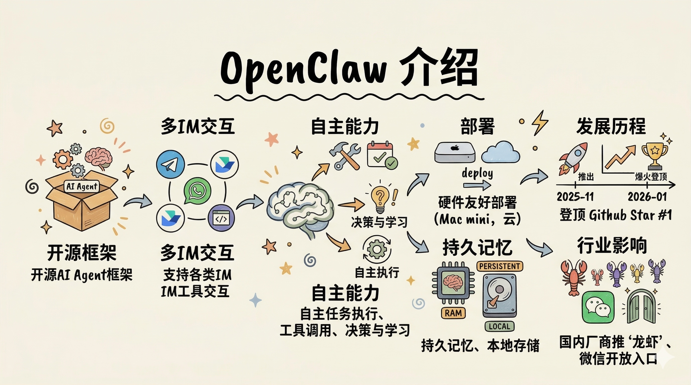

#### 上下文规则体系

OpenClaw 通过一系列 Markdown 文件来管理 Agent 的行为和上下文:

| 文件 | 用途 |
|------|------|
| `AGENTS.md` | Agent 操作指令和规则 |
| `SOUL.md` | Agent 人格和沟通风格 |
| `USER.md` | 用户档案和偏好 |
| `IDENTITY.md` | Agent 名称和头像 |
| `TOOLS.md` | 本地工具文档 |
| `MEMORY.md` | 长期记忆和决策记录 |

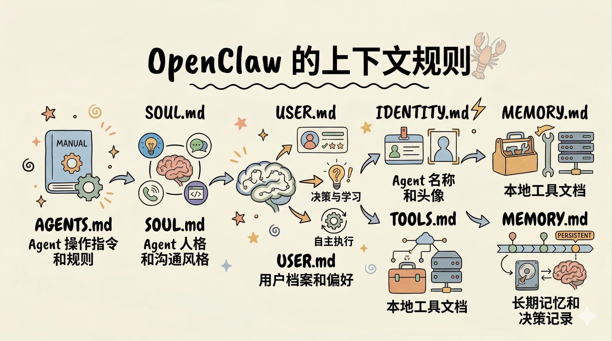

#### 企业应用案例

某企业已在多个业务场景中部署了 OpenClaw:

1. **市场**: 打通销售系统, 汇总前日线索, 建议今日计划, 自动私信相关销售人员.
2. **项目管理**: 阅读项目售前需求和客户调研报告, Review SOW 文档, 给出风险提示和优化建议.
3. **研发运维**: 每日 AI 消耗统计与排名, 余额不足监控, 自动发送群聊通知.

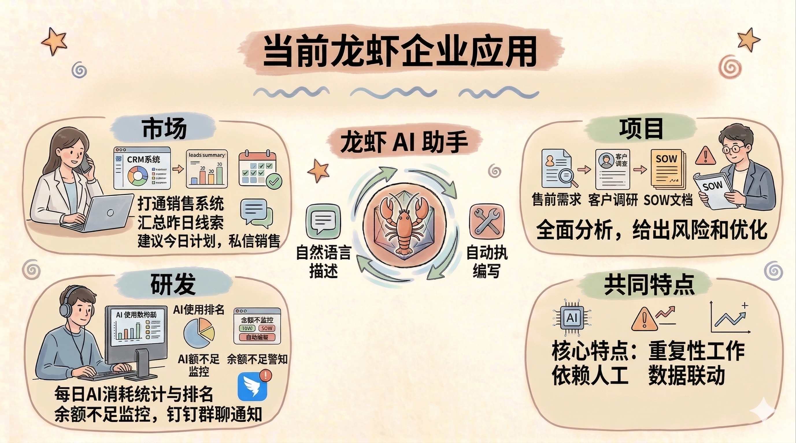

#### 优势分析

1. **交互方式创新**: 通过 IM 工具交互, 符合企业日常沟通习惯, 无需学习命令行, 大幅降低使用门槛.
2. **功能丰富**: 使用 LLM 的 Agent 能力, 支持自主任务执行、工具调用和持续学习, 能够处理复杂的工作流程.
3. **记忆能力**: 本地存储交互历史, 具备持久记忆能力, 可以通过不断调整优化响应质量.
4. **开源生态**: 社区贡献活跃, 迅速涌现出大量的技能和插件.

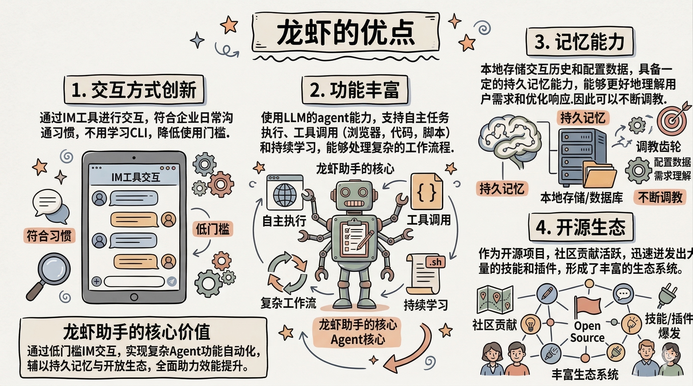

#### 局限性分析

1. **稳定性不足**: 草台班子的架构设计和纯AI驱动, 频繁的更新有时会引入更多问题.
2. **并发能力有限**: 使用 Markdown 文件作为数据存储, 单 Agent 只允许一个活跃会话, 其他会话需排队等待.
3. **权限风险**: 不开放权限则功能受限, 开放权限则面临系统攻击、数据泄露、高危操作(文件删除)等风险.
4. **安全隐患**: 默认公网暴露, 第三方 Skills 插件中可能存在恶意代码——窃取数据、删除文件等.
5. **企业适用性**: 不同用户使用同一个 Agent 时, 记忆会发生共享; 新会话接入需修改配置并重启; 企业 SOP 存在泄露风险.
6. **成本偏高**: 完成同样的任务, OpenClaw 的消耗可能是 Claude Code 的数倍, 且成功率不一定有保障.

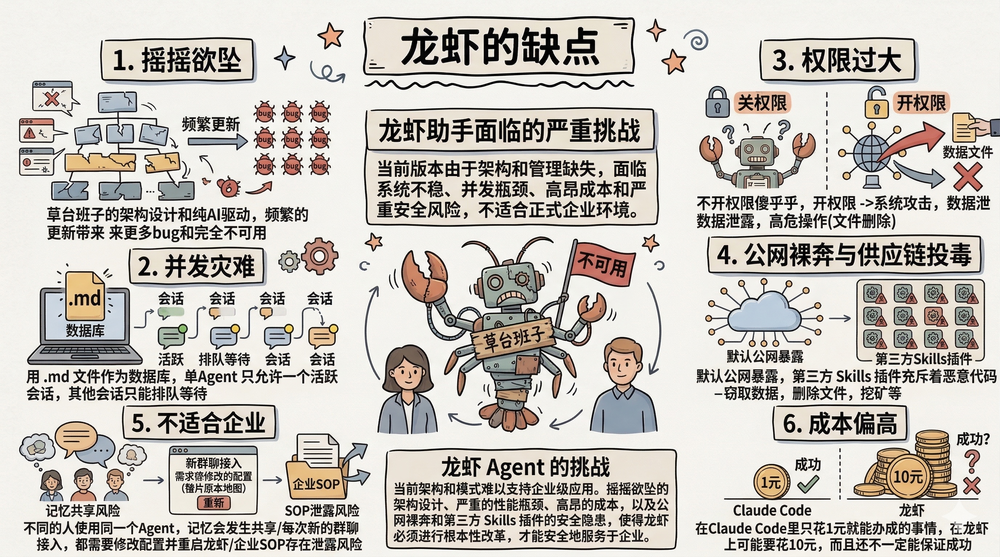

#### 落地建议

1. **认清本质**: OpenClaw 的核心能力来自于聪明的 LLM、上下文工程和 Skills——而非框架本身.
2. **优先级策略**: OpenClaw 能做的事情, Claude Code 通常做得更好更快. 建议先用 Claude Code 完成 MVP 并转化为 Skills, 如有远程操作需求, 再零成本迁移到 OpenClaw.
3. **安全意识**: 运行环境内不应存放机密和隐私信息, 不应开放高权限操作.
4. **适用范围**: 更适合个人或小团队使用, 与通用的企业 AI 助理场景存在差距.

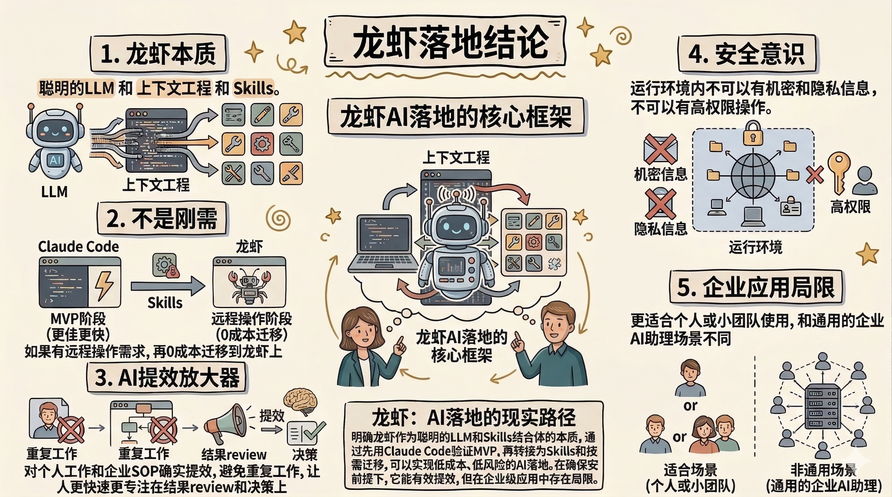

---

## 五、总结与展望

回顾全文, 可以提炼出以下核心观点:

1. **回归本质**: AI 的本质始终是"提示词 → LLM → 回答". 好的工具让 AI 更好用、更省心, 但底层逻辑不变.
2. **坚持最优模型**: 使用最强的模型, 有助于提升个人对 AI 产出质量的"美感", 并逐步总结出适合自己的 AI 方法论.
3. **无需焦虑**: 不必追逐每一个新工具和新模型. 掌握了核心原理和一个好的工具(如 Claude Code), 就足以应对绝大多数场景.
4. **提示词来自专业度**: 好的提示词, 源于对事情足够专业, 同时离不开结构化的思维, 确保输入与输出形成闭环.
5. **实践为王**: 不存在一键搞定龙虾, 也不存在一键搞定企业SOP. 只有真正去实践的人, 才会知道 AI 能不能帮到自己, 能帮到什么程度.
6. 愿意尝试的人, 会自发得去实践. 不愿意尝试的人, who care.

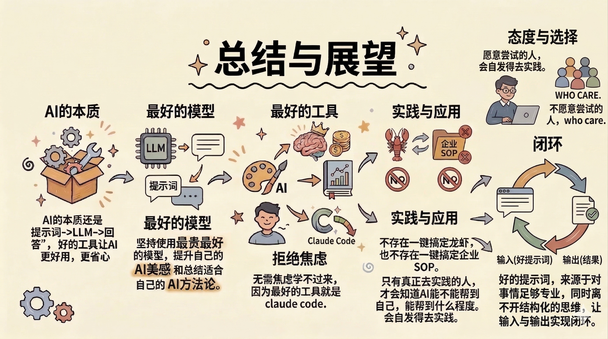

---

## 附录

### 术语表

| 术语 | 说明 |
|------|------|
| LLM | Large Language Model, 大语言模型 |
| Prompt | 提示词, 用户输入给模型的指令或问题 |
| Context Window | 上下文窗口, 模型单次能处理的最大 token 数 |
| Agent | 自主规划与执行的 AI 智能体 |
| ReAct | Reasoning + Acting, Agent 的核心工作框架 |
| MCP | Model Context Protocol, 模型上下文协议 |
| Skills | 以自然语言定义的可复用 Agent 技能 |
| RAG | Retrieval-Augmented Generation, 检索增强生成 |
| KV Cache | Key-Value Cache, LLM 推理加速的缓存机制 |
| SOP | Standard Operating Procedure, 标准操作流程 |
| Constitutional AI | 宪法 AI, Anthropic 提出的 AI 安全对齐方法 |
| OpenClaw | 开源 IM 交互式 AI Agent 框架 |

### 推荐资源

- [LangGPT 提示词专家](https://chatgpt.com/g/g-Apzuylaqk-langgpt-ti-shi-ci-zhuan-jia) — 结构化提示词生成工具
- [Anthropic Claude Code](https://docs.anthropic.com/en/docs/claude-code) — 官方文档
- [OpenClaw GitHub](https://github.com/openclaw/openclaw) — 开源项目仓库
